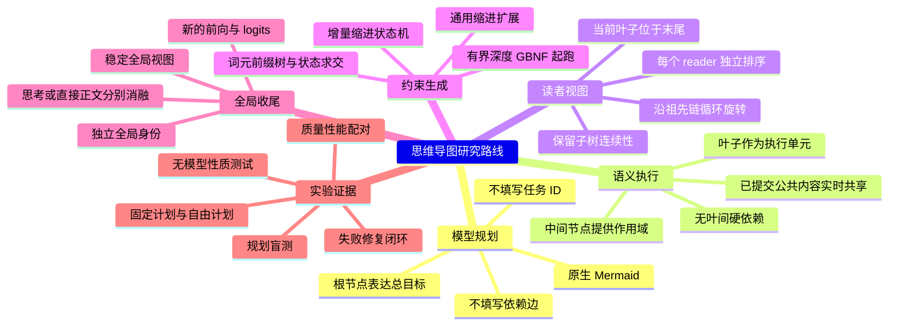
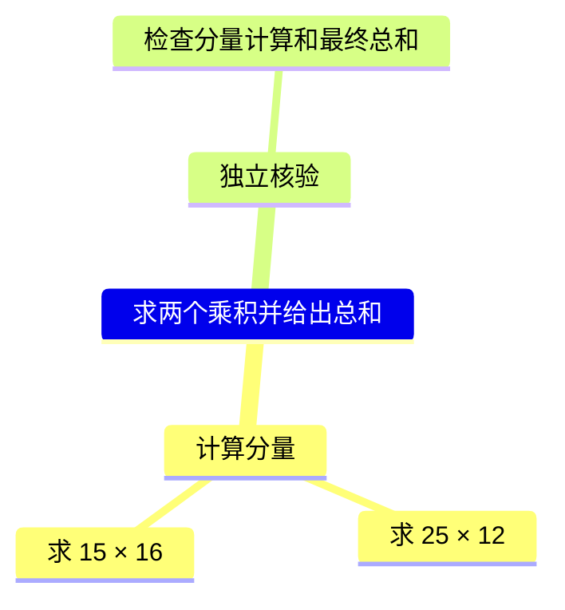
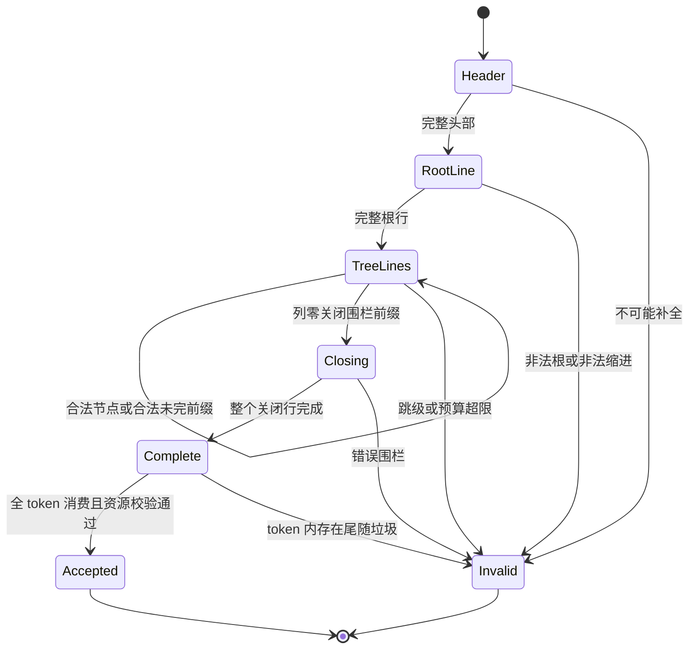
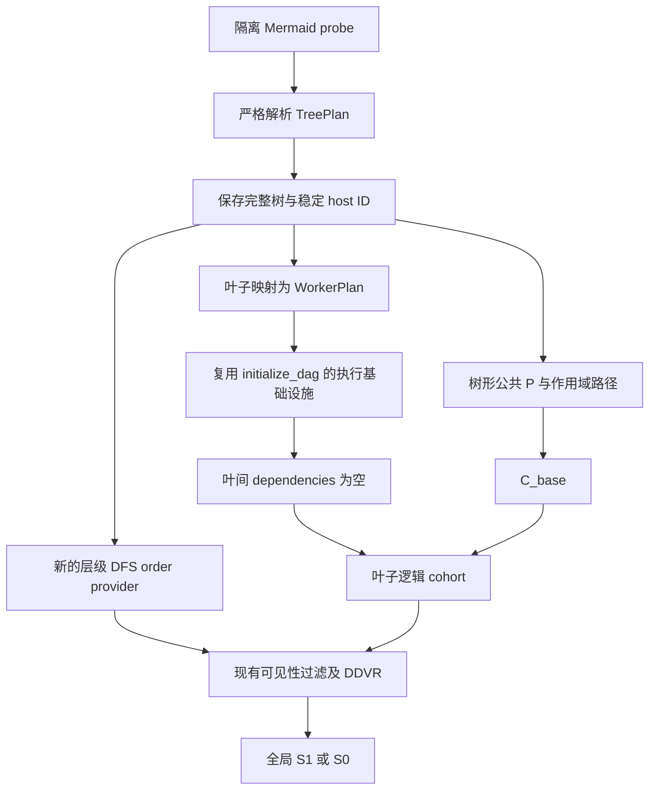
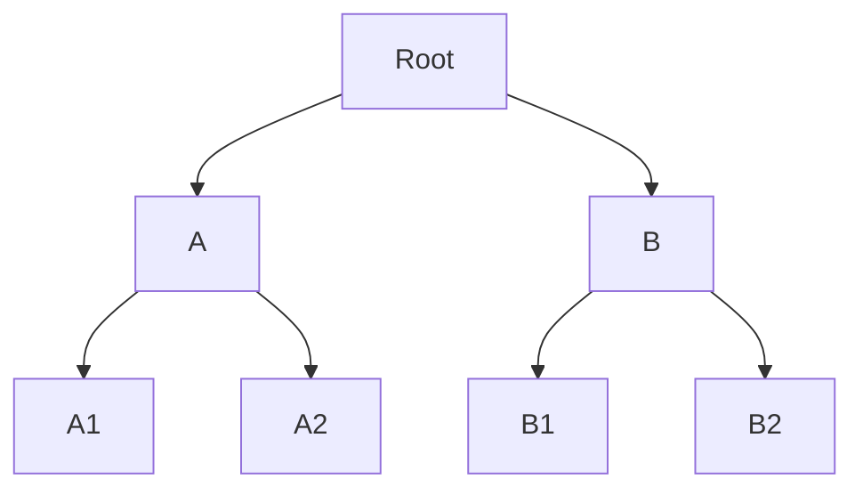
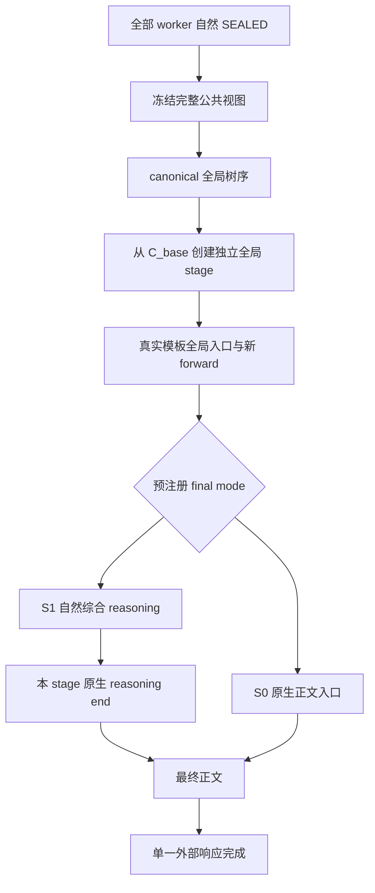

# 保姆式地毯式思维导图实验方案（Mermaid）

> **研究主张：先把思维导图路线做对、做全、认真打磨，再用配对实验决定适用范围；不把既有产品选择当成不可挑战的自然规律。**
>
> **状态：实验设计与可执行参考，不是新引擎已经上线。** 本文新增一条独立、显式 opt-in 的 `MM-R1` 研究线；不静默改写 `RERoT.md` 的当前生产契约，不恢复旧 survivor，不自动启用服务。模型面对的主协议必须是原生 Mermaid mindmap，而不是重新包装后的 DAG JSON。

| 项目 | 本次口径 |
|---|---|
| 调研日期 | 2026-09-23 |
| 仓库审计点 | `master@b0f512f52`；其父代码基线为 `a35ec96f6` |
| 交付前复核点 | 工作期间外部更新至 `4e17c2faf`；本文所核查的 RERoT 核心源文件未变，文档与 TP5 交接有更新，见 §16 |
| 进入时工作树 | 仅发现既有未跟踪 `logs/`；不覆盖、不清理 |
| 用户原始材料 | 本轮附件《思维导图.md》，包含 Mermaid、无依赖并发、逐 reader DFS、全局接手及缩进约束的讨论 |
| 源码事实 | 用 `[Rxx]` 标注，见文末源码索引；行号绑定本次审计点 |
| 外部研究 | 用 `[Wxx]` 标注，见文末一手来源；不把其他引擎的论文数字当成本仓库结果 |
| 本文新设计 | 协议 `MM-R1`、实验臂、阈值、任务卡与新增接口均为**提案**；未标为“现有”的名称不能当作已实现参数使用 |
| 实验原则 | 数学正确性、协议正确性、任务质量、端到端收益四本账分开；一次失败只否定已测试的具体实现或配置 |

## 0. 总览：必须落地的是什么



**第一条要跑通的真实路径：**

`普通请求 → C0 → 隔离 Mermaid probe → TreePlan → 正式树形 P / C_base → 叶子 cohort → reader-specific 层级 DFS / DDVR → 全局 S1 → 最终正文`。

**第一阶段可复用现有 DAG 调度基础设施，但不得偷换语义：**只给叶子建立执行记录，叶子之间的依赖集合为空；中间概念节点不占 lane；保存真实 TreePlan；逐 reader 的树形排序最终必须独立落地。内部暂用 `initialize_dag()` 是复用容器，不代表模型重新承担 DAG 规划，也不代表叶间重新出现屏障。

**最终必须实际检验的两个高价值假设：**树层级能否改善任务拆解与协作；去掉人为叶间依赖后，已提交上下文共享能否获得更好的质量—延迟折中。只做 Mermaid 转 JSON、从不测试树视图和无依赖协作，不算完成本文。

## 1. 先校准争论：哪些能证明，哪些必须测

| 争议 | 本文判断 | 对应验证 |
|---|---|---|
| “树不能表达任意 join，因此这条路线不可行” | 树不能原样承载任意 DAG 的硬依赖；但本路线主动取消叶间硬依赖，以层级表达语义作用域，根实体承担最终整合。表达目标不同，不构成不可行证明。 | 依赖密集任务与独立任务分层评分，不只测有利题型。 |
| “多个叶子同时最后，必然撕裂 DFS” | 错把多个 reader 的视图当成同一条全局序。每个 reader 单独沿根到叶路径旋转，当前叶子最后与子树连续可以同时成立。 | §5 的归纳证明、反例与独立参考程序。 |
| “自回归错误一旦写出，就不能再纠正” | 已提交历史不会自动改写，但后续计算和最终回答可以修正先前结论。不能从 append-only 推出“无法纠错”；也不能假设尚未生成的专有信息已经可见。 | 延迟事实、错误草稿、后续纠正、最终采纳率四类任务。 |
| “KV 就是所有分支的全局认知” | 当前实现精确共享的是符合可见性条件的公共 K/V；recurrent、conv、sampler 是 stage-local。不能把共享注意力等同于所有隐状态已同步。[R02] | 纯 attention 模型与 hybrid recurrent 模型分开；记录有效发布边界。 |
| “Mermaid 缩进无法做约束采样” | 无此不可行结论。有界深度可生成普通 GBNF；动态缩进可用增量 lexer 与语法状态的乘积。后验解析与先验 mask 是不同工程任务，都要做。 | G0/G1/G2 三层路线，逐 token/逐字节差分测试。 |
| “GBNF/JSON 是零开销静态查表” | 本仓库 `llama_grammar_apply_impl()` 会遍历候选、解码 piece、按 grammar stacks 检查；不能将复杂度抹去。[R08] | 冷编译、热 mask、accept、状态复制分别计时。 |
| “LLM 必然更熟悉 JSON / 必然更熟悉 Mermaid” | 附件没有目标模型训练分布与等预算对照；两种绝对判断都没有足够证据。 | 同模型、同模板、等调参机会的规划盲测。 |
| “单线程接手证明必须保留额外全局思考” | 全局所有权与额外 reasoning token 是两个变量。需要新全局前向，不自动证明需要多少思考 token。 | S1 自然综合与 S0 直接正文分别测。 |
| “旧 Ring 失败已否定新思维导图” | 旧实现同时捆绑 HTML、结束协议、survivor、视图及状态策略。捆绑系统失败不能定位到 Mermaid 或树结构。[R01] | 不复活旧入口；分因素消融，保留现代状态边界。 |
| “改动只有几百行、性能必然更好” | 没有根据的工期、代码量和速度承诺不进入验收。 | 以任务卡、差分证据和实际成本账作为完成依据。 |

外部依据只支撑方法可行性，不替代本机验收：Mermaid 官方说明 mindmap 基于缩进，也会容忍部分不明确缩进；机器协议可以选择其严格子集。[W01] SynCode 提供增量解析、词法 mask 及缩进相关实现示例；XGrammar 与 XGrammar 2 提供栈共享、缓存、动态调度等可参考技术。[W03–W05] CRANE 提醒过严的输出约束可能影响推理质量，因此本计划另设“隔离草拟后再约束”的消融，而不是预设 eager 最优。[W06]

## 2. 仓库现状与改动边界

### 2.1 已核查的事实

1. 当前 wire 是 `strategy + payload` JSON，`questions` 与 `depends_on` 显式建图；eager GBNF 与 512-token probe 上限已接线。[R03–R04]
2. `initialize_dag()` 建立 worker、`0.plan` 与独立 synthesis；`build_dag_view()` 使用逐 reader 循环优先 Kahn；`C0/C_base`、固定入口、PUBLIC 发布与 W>P 的基础设施存在。[R05–R07]
3. `RERoT.md` 已明确：历史 Ornith 阶段验收不能自动覆盖当前 HEAD。附件中“当前生产已被充分证实”的说法过强。[R01]
4. `AGENTS.md` 的 2026-09-22 回滚交接记录了独立双算式被规划成互相依赖而 HTTP 500 的案例。这是**历史记录，不是本轮模型复测**，却足以构成立项理由。[R11]
5. `server_rerot_parse_routing_decision()` 上方仍有 Compact Dict 的旧注释，实际函数读取 strategy/payload。后续应修正注释，不能按旧注释设计接线。[R03]
6. `rerot-phase8-quality.py` 部分 verifier 允许只在 reasoning 中命中正确字符串；这不足以证明最终回答正确。`test-gbnf-validator.cpp` 对不合法输入也走最终 `return 0`，不能只用退出码判定语言接受。[R09–R10]

### 2.2 保留的工程不变量

| 不变量 | 新路线的要求 |
|---|---|
| 同一推理栈 | 不为每个叶子创建独立 server request、独立 llama_context 或独立全量 KV。 |
| 身份分域 | `request / tree_node / execution_stage / lane label / pen / seq / run` 不混用。 |
| C0 恢复 | 根节点单独构成的导图走 simple，销毁 probe 分支，恢复完整 sampler/RNG/penalty/parser 与 logits 边界。 |
| C_base | 正式公共 P 注入完成后才捕获；所有新 worker 与全局实体使用匹配边界的状态。 |
| 原生 recurrent | GDN、conv、sampler 仍 stage-local；不平均、拼接或隐式重放 foreign recurrent。 |
| DDVR | 只改逻辑 run 顺序与虚拟位置；不为旋转搬写整份 K；所有 spans 进入同一 query/head softmax。 |
| STRONG | frontier f 读已提交前缀，f 的公共增量在 cohort 提交后才对下一步可见；禁止同拍穿透。 |
| 源结束 | worker 自己自然生成并提交的结束事件才 SEALED；固定入口里的结束字面量不能冒充完成。 |
| W>P | 逻辑 cohort 与物理笔分离；不把“少数笔先跑到结束”伪装成逻辑全并发。 |
| 所有权与 API | 最终由全局实体拥有响应；规划/FRAME 不泄漏普通 content；一个 finish 和一个 `[DONE]`。 |
| 资源与失败 | 有界、可诊断、fail-closed；不裁树、删任务、改 simple、关闭 watchdog 或修改显卡频率来“跑过”。 |

### 2.3 本研究允许显式变化的选择

模型 wire、是否存在叶间硬依赖、reader 排序、最终额外思考长度都可以作为研究变量。实验开关与 manifest 必须记录它们。**兼容性不意味着研究永远不能改变语义；改变语义必须有独立名称、测试与证据，不能假装旧契约没变。**

## 3. 协议 MM-R1：真正让模型输出 Mermaid

### 3.1 唯一主 wire

以下整个 fenced block 是 probe 输出。开始、结束围栏都属于隔离控制输出；内部的 `mindmap` 是标准 Mermaid 图定义。

````text

````

初版不用形状、图标、样式、HTML、Markdown Strings 或模型填写的 ID。官方支持纯缩进文本形式，因此这仍是原生 Mermaid，而不是自创伪 Mermaid。[W01]

| 项目 | MM-R1 精确定义 |
|---|---|
| 字节封装 | 固定前缀为 `\x60\x60\x60mermaid\nmindmap\n`，固定后缀为 `\x60\x60\x60\n`；关闭围栏必须在列 0。 |
| 换行 | 仅 LF；CRLF、Tab、空白行、前后散文一律拒绝。未来兼容 CRLF 须另立版本，不做静默规范化。 |
| 缩进 | 根恰好 2 个 ASCII 空格；每深入一级增加 2；不能跳级；同级或退回祖先级合法。 |
| 根 | 恰好一个；第一个节点必须是根；后续第二个根非法。 |
| 标签 | 非空单行，内部可有单个 ASCII 空格；首尾无空格。起跑字符集见附录 GBNF，包含中英文及常见算式符号。 |
| 初始限额 | 默认深度 4（根为第 1 层）、节点数 64、叶数 8、单标签 96 个 Unicode 标量、总 wire 16 KiB、probe 512 tokens。均为初始提案，不是性能结论。 |
| 深层研究 | 深度 8/16/32、叶数 16/32 另作资源阶梯；“有界”是服务预算，不是宣称更深层在理论上不可行。 |
| 终止 | 收到完整关闭行后，检查本 token 的全部剩余 bytes；任何围栏后垃圾都非法。不能在 token 中途发现围栏就提前接受。 |
| 策略 | 仅根、无子节点 → simple；存在子节点 → tree 模式，即使只有一个可执行叶子也不偷偷降级。 |
| 依赖 | 缩进是语义包含，不是启动依赖。`1.`、`2.`、`先`、`再`等标签文字绝不自动编译成边。 |
| 重复文字 | 相同标签允许出现在不同路径；节点身份由 host 分配，不能用标签相等来合并节点。重复任务质量单独扣分。 |

**完整合法与资源可承载分开：**有限深度 GBNF 可负责结构；节点/叶子/标签等预算在 parser 中显式检查。超额返回 `resource_limit`，不能伪装成语法错误或自动截断。G1 的联合 mask 再逐步把这些预算纳入可继续性检查。

### 3.2 增量判决，不靠“等到 EOG 再猜”



解析 API 提案为 `parse_status = incomplete | complete | invalid`，另带 `error_class`、byte offset、line、column、depth、consumed bytes；`resource_limit` 是明确错误分类。`incomplete` 必须表示“仍存在合法完成”，不是所有 parse exception 的统称。

至少钉住：半个 UTF-8 字符、半个 `mindmap`、1/3/5 个行首空格尚待补全、只到关闭围栏第一个反引号、关闭围栏后还带普通字符、没有末尾 LF、两份围栏、节点中出现围栏。完整节点行可更新临时 AST，但**整棵树通过前不得启动 worker**。

### 3.3 可直接使用的规划 prompt 草案

```text
将当前请求组织成一棵 Mermaid mindmap。只输出一个 mermaid 代码块。
根节点写用户总目标。中间节点写任务维度；叶子写明确、可执行的子任务。
每层缩进两个空格，根缩进两个空格；最多四层、八个叶子。
不要输出任务 ID、依赖边、样式或最终答案。
叶子会并发推理，并能在提交边界看到其他叶子的公共进展。
不要把必须连续计算的每个微步骤机械拆成不同叶子；可把一段完整局部推导放在同一叶子。
需要跨分支整合的结论由全局阶段完成。
简单问题仅输出一个根节点，不为并发而强行拆分。
```

prompt 必须以 `\n` 结束，保留现有 arm probe 的换行检查。[R04] 不在 prompt 中给带固定答案的示例；few-shot 使用独立训练题。0-shot、2-shot、允许隔离草拟三种提示策略分别调优，DAG 基线获得相同调参机会。

## 4. TreePlan 与执行记录：保留树，不让模型做编译器

### 4.1 三种关系，三个字段

```text
TreeNode.parent / children     = 概念包含关系
WorkerPlan.scope_path         = 意图上下文与 reader 排版依据
WorkerPlan.hard_predecessors  = MM-R1 中恒为空
```

`TreePlan` 提案字段：`schema_version, nodes, root_index, original_wire, canonical_wire, tree_hash, limits`。节点保存 `host_node_id, parent_index, children, label, depth, preorder_rank, subtree_interval`。

`WorkerPlan` 字段：`host_worker_id, tree_leaf_id, scope_path, intent, canonical_leaf_rank`。根不独立占 worker；中间节点不分配 recurrent blob。一个叶子生成恰好一个 worker，不按路径重复展开或复算。

资源估算至少包含 `W × lane_local_state + prefix/KV + ΣF_i + worker budgets + final budget + park/checkpoint`。标签长度合法不代表完整 `F_i` 的 tokenizer 长度合理，必须在真实模板渲染之后再做 token admission。

### 4.2 复用现有后端的最小接法



第一笔接线可以在内存中构造现有 `server_rerot_routing_decision`：为叶子分配 host ID，questions 顺序采用 canonical DFS，`dependencies = {}`。**禁止把它重新序列化成 JSON 给模型看。**在 episode 上保留 TreePlan 和 `plan_kind=mindmap`，不要只保存叶子列表后把树丢掉。

现有 `initialize_dag()` 会自动加入 `0.plan → workers → 0.synthesize` 的阶段关系。[R05] 这是启动基底与最终收口屏障，不是被消灭的叶间人为依赖。MM-R1 的检验断言是：任意两个不同 worker 之间都没有 hard edge。

### 4.3 P 与 F_i 不得继续偷偷拍平全部语义

`server_rerot_format_plan_prefix()` 当前输出扁平 `plan:` 项目列表。[R03] 新增按 plan kind 分派的 formatter：正式 P 保留规范化 Mermaid 树；JSON 对照可用同一规范化 P，隔离 wire 影响。

叶子固定入口使用真实 chat template 的原生 subagent round，并在 intent 中包含：总目标、祖先路径、本叶任务、协作约定。概念上例如：

```text
总目标：求两个乘积并给出总和
作用域：计算分量 / 求第一项
本叶任务：求 25 × 12
协作：参考已经提交的公共进展；将暂定结论标明为暂定；发现矛盾时继续核验。
输出职责：完成本叶推导，不冒充最终全局回答。
```

这是叙事信息，不是额外调度 DSL。不要靠 `#`、`##` 或“已完成”字样驱动状态机。对标签实施 protocol-marker 安全检查与模板转义；禁止从标签注入原生关闭 token、伪 tool message 或任意新控制事件。

不要为动态 reader 顺序重新 tokenize/forward F_i。F_i 只依赖目标叶子和冻结 TreePlan；每次 reader 旋转只移动逻辑 runs 的顺序。这样不回到旧架构的重复 frame 回放。

## 5. 层级循环 DFS：证明、算法与 DDVR 接线

### 5.1 定义与具体反例

对 reader 叶子 r，从根沿唯一路径下降。在路径上的每个内部节点，将包含 r 的那个 child 子树通过**循环移位**放到最后；其他子树作为完整块移动。路径外保持原 child 顺序。



```text
reader A1：B1, B2, A2, A1
reader B1：A1, A2, B2, B1
final root：A1, A2, B1, B2
```

这里 A1 与 B1 使用不同视图。A、B 的子树各自在相应序列中连续；不存在“必须把 A 撕成两半”的问题。

### 5.2 归纳证明

叶子子树只有一个叶子，性质成立。假设路径 child 内的递归排序满足：叶子覆盖唯一、每个子树的叶子形成连续区间、r 最后。父节点将该 child 的**整个结果块**放在所有 sibling 块后面；每个 sibling 仍是完整 DFS 块。因此覆盖与连续性保留，r 也在父子树最后。沿根路径归纳即得全树结论。

该证明只关于**排序与覆盖**，不证明模型一定协调成功、不证明其 logits 等价于最终 transcript 串行 prefill，也不允许读取未来 token。对有显式硬依赖的 DAG 不能直接使用这个无依赖树证明。

### 5.3 算法提案

```text
path_child = 从 r 沿 parent 回溯，建立每个祖先指向路径 child 的表
visit(u):
    如果 u 为叶子：emit(u)
    否则：
        children = canonical_children(u)
        如果 u 在 path_child：
            k = 路径 child 在 children 中的位置
            children = children[k+1:] + children[:k+1]
        按上述 children 顺序递归 visit
```

简单实现每 reader 为 O(N) 发射加 O(D) 路径准备；若每层重复扫描整棵树找 contains(r)，会不必要地变成 O(ND)，避免之。order 可以按 `(tree_hash, reader_leaf_id, order_version)` 缓存；每步 visible 长度仍需按当前发布状态更新。

**不要只旋转 canonical 叶子平铺序列。**在深层树上，平面环移会让 reader 所属子树跨越序列两端；层级旋转与无边 Kahn 的平面环移并非一般等价。这正是单独比较 C4/C5 的原因。

### 5.4 对接可见性，不能复制一份不完整过滤器

从当前 `build_dag_view()` 抽出公共 `append_visible_run`/发射逻辑，令 order provider 可选 Kahn 或 tree-DFS。两条路径共享：same episode、kind、PUBLIC/PRIVATE、owner、source-end 过滤、frozen publish epoch、run 内顺序、storage/virtual 映射及 query position 计算。[R06]

完整树顺序先确定，再过滤未启动、未完整发布或当前不可见的 run；不能以 ready_queue、物理 slot 或本轮谁先算完重定义 tree order。已 SEALED 的公共历史仍保留。当前 reader 的 own-private/own-pending 例外沿用现有规则，不可因公用过滤器而错误套上 peer frontier gate。

设可见 run 长度为 `len_j`，虚拟起点为其前缀和；现有 DDVR 继续按 `q + storage_pos − virtual_pos` 做 Q 侧位置变换。[R02] **改变顺序之后必须让布局 stamp/缓存失效，不能只换向量而沿用旧 attention layout 或旧 logits。**

新增字段涉及持久化时升级状态版本，保存树、worker 映射、排序版本、当前 phase 与必要 hash。probe 中 save 仍按现有规则拒绝。旧 DAG 存档继续按旧语义读取；新树存档绝不能被旧代码当成 DAG 静默加载。

## 6. 约束器三步走：让 GBNF 扩展真正成为研究任务

### 6.1 G0：普通有界深度 GBNF，立即验证任务价值

附录 A 给出可用的 depth=4 文法。每一层生成固定空格字面量，`node-d ::= indent-d label LF node-next*`，最大层不再递归。因此无需等待通用缩进扩展就能验证 Mermaid 主路线。

规则数随最大深度线性增长；若直接复制每级缩进字符串，文法文本字符数可到 O(D²)。实际文法栈数、mask 时间和 close 倾向必须测，不能从“规则少”跳到“零开销”。G0 的节点数、叶子数与标签长度由终态 parser 兜底；不宣称它单独保证全部资源约束。

### 6.2 G1：专用、完整的增量缩进 sampler

**不是只屏蔽空格 token。**任意一个 token 都可能同时包含换行、缩进、节点正文和关闭围栏，因此必须模拟完整 piece。

状态至少为：

```text
S = (envelope_phase, grammar_states, indent_stack, at_line_start,
     pending_spaces, partial_utf8, label_state, label_length,
     node_count, leaf_count, pending_node_has_child, limits)
```

对 MM-R1，缩进单位固定为 2，可以使用 depth 栈；通用扩展才需支持任意列栈。遇到非空白才确认缩进级别。关闭围栏前要在词法层生成适当退栈事件；EOF/EOG 只有在整个 envelope 完成时才合法。空白行、Tab 与 CRLF 当前明确拒绝，避免暗藏不同列计算规则。

定义目标 mask：

```text
allow(S, token) = 追加完整 token piece 后，仍可完成为 MM-R1 合法文档
```

第一版 correctness oracle 可以对每个候选 token 克隆 S 并逐 byte 推进，复杂度按候选 piece 总字节数与活动解析状态数计算。慢 oracle 只做测试，不因它慢就否定路线。

生产版采用 token-byte trie 与状态机联合遍历，共享候选公共前缀；缓存文法内部普通 label token，边界 token 走完整模拟。冷热分开测。每次 `apply()` 必须纯读当前状态，只有实际 `accept()` 才推进；clone/reset/checkpoint/rollback 必须完整复制缩进及 UTF-8 状态。

**联合语言陷阱：**两个独立 sampler 都认为某前缀可继续，并不一般保证存在一个后缀同时满足二者。不能只对“各自可补全”的 mask 做交集就宣称完整性；最终许可应以 grammar × lexer × envelope × budget 的乘积状态可继续性为准，或为受限语言给出等价证明。

缓存 key 至少覆盖 tokenizer/vocab hash、协议与字符集版本、grammar 状态集合、完整缩进栈、行首状态、UTF-8 残片、标签/节点/叶子预算、关闭阶段。仅按 top-indent 缓存会把不同栈与预算混淆。

### 6.3 G2：可复用的缩进感知 GBNF 扩展

目标是在 G1 有真实 correctness/perf 证据后，把词法层 INDENT/DEDENT 接到通用 grammar API，形成可审查的独立功能，而不是一直停留在固定深度绕行。

候选事件为 `INDENT / DEDENT / NEWLINE / EOF`；新表面语法名可再设计。**`%indent`、`%dedent` 目前不是本仓库已存在的语法**，本文不提供假装能直接运行的扩展文法。

需要明确：多次 dedent 如何展开、闭合括号中的换行是否抑制缩进、空白行、Tab policy、注释、UTF-8、EOF 补 dedent、多 grammar 分支共享 lexer 的边界。MM-R1 先不引入 Python/YAML 的全部语义。不能宣称支持 Mermaid 就已经支持完整 Python/YAML。

若普通 GBNF 保有多活动栈，状态应按完整乘积集合推进；不能未经证明就叫“一个 DPDA 栈足够处理全部 GBNF”。通用接口要让现有不启用缩进的 JSON/用户 grammar 路径保持原行为与近零额外常数成本。

### 6.4 约束器必须覆盖的测试族

| 测试族 | 必须出现的输入/状态 | 验收 |
|---|---|---|
| 分词跨界 | `LF + spaces + label`；一个 token 跨多行；一个 token 包含关闭围栏及垃圾 | 完整 piece 检查，不提前提交 |
| 字节切分 | 每个合法样本按所有 byte 边界切分；真实 tokenizer 多种分词；UTF-8 拆开 | 最终 AST 一致；错误偏移一致 |
| 缩进 | 0/1/2/3/4 空格；跳级；多次 dedent；退到不存在的列；最大深度边界 | 非法不能被 accept；合法不能被误杀 |
| 终止 | 半围栏、提前 EOG、完整 EOG、缺末尾 LF、合法文档加任意垃圾 | 终态一致，终止原因可解释 |
| 状态生命期 | clone 后分叉、reset、abort、probe 释放、跨请求复用 sampler | 不串状态、无 use-after-free |
| 预算 | 最后一行增长使节点超限；父节点变内部节点导致叶数变化；剩余 token 不足关闭 | 清晰资源失败，不空 mask 自旋 |
| 缓存 | 同 top-indent 不同栈；同语法不同词表；同前缀不同预算 | 命中与不命中结果完全一致 |
| 性能 | 冷文法、热文法、宽词表、长多行 piece、深树、重复前缀 | p50/p95/p99、峰值内存、缓存命中率 |

G1 必须与慢 oracle 对拍实际全词表 mask；只比较最终文本是否合法，抓不到合法 token 被大量误杀的问题。首轮建议至少 10,000 个状态做分层抽样；全词表成本过高时先选 1,000 状态全查，其余查边界 token，分别报告覆盖范围，不混称“全覆盖”。

## 7. 无依赖协作：把争论变成可观察机制

### 7.1 主臂的执行契约

所有叶子在正式 C_base 就绪后逻辑 eligible。P 个物理 pens 以现有 W>P 机制推进 W 个叶子的同一 logical frontier。已提交 PUBLIC 在下个边界可见；叶子可以参考、补充、质疑、纠正，但不要求每步都点名别人。

**不人为把独立题串行化；也不要求缺输入的叶子假装已经知道结果。**规划 prompt 鼓励将连续局部计算保留在同一个叶子，并把多分支综合交给全局实体。这是任务粒度设计，不是偷偷建立依赖边。

给 worker 的协作提示需要单独消融：无额外提示；简洁职责提示；显式“暂定/已核验/发现矛盾”提示。文字标记先只作内容，不新增调度语义。

### 7.2 四个必须直接观察的问题

| 问题 | 试验构造 | 记录 |
|---|---|---|
| 能否利用 peer 信息 | 固定生产者在指定 frontier 才发布任务专有值，消费者此前拿不到该值 | 发布前猜测、发布后采纳、首次正确 token 的 frontier |
| 能否纠错 | 先发布可识别的暂定错误，再发布可靠纠正；反向顺序作对照 | 初次承诺、修正延迟、最终正确率、错误复述率 |
| 是否无效等待 | 生产者延迟 0/8/32/128 frontier | 等待措辞比例、重复 token、空转成本、失败率 |
| 是否越聊越错 | 分支异质初始意见、相关错误与独立错误分别构造 | 共识正确率、错误感染率、少数正确意见保留率 |

“指定 frontier 的专有值”先在模拟 trace/harness 中注入并清楚标注为机制实验；随后在真实模型的任务拆解中复测。不能把干预注入的 oracle 信息当成自由规划模型自己推出来的成果。

### 7.3 当主臂不理想，允许怎样打磨

按顺序定位：任务粒度 → prompt 职责/假设标注 → 叶数 → token 分配 → 公共信息密度 → 收尾思考。每次只改一个主因素，并保留未经修补的主臂。

研究性 `yield/revisit`、分阶段开放、显式依赖混合模式可作为**独立救援臂**；需要新事件、状态和预算，不允许把普通文字“等待”当 yield。救援臂成功不证明“纯无依赖”已成功；纯臂失败也不证明“Mermaid 与树形规划”失败。

本轮第一版不引入动态增删树、运行中再规划、任意内部节点生成、无限等待或递归 DAG。这些会同时扩大语义面，先把静态多层树与真实并发打通。

## 8. 全局接手：S1 与 S0 都有正式位置



### 8.1 S1：先建立可靠参考，不等于判定 S0 错误

复用独立 `0.synthesize`：C_base、冻结全局 view、`F_0s`、fresh logits，然后模型自然结束 reasoning 输出正文。这个版本先证明 Mermaid + 无边叶子 + 树视图的端到端可行性。

### 8.2 S0：全局实体直接正文，不是最后 child 接管

S0 同样拥有新 global stage、全局顺序与正确 C_base。它省的是额外全局 reasoning token，不省模板接手、新 forward、状态建立与 attention 成本。

第一颗正文 token 必须来自**新全局视图下的 logits**。只修改 view 元数据、沿用最后一个叶子的 logits，是错误实现；拿最后一个叶子的 recurrent state 改名为全局也是错误实现。

真实模板需提供合法的正文起点；若使用受控 native reasoning-end 进入正文，该 token 属于显式的全局入口/转换来源，不能伪称 worker 自然结束，也不能混入旧 `source_end` 解锁路径。现有 final handoff 对 committed native-end provenance 有断言，S0 必须新增独立受测入口，不能直接删除断言。[R07]

### 8.3 终态消融与验收

比较 S1-natural、S1-short（明确独立预算/终止策略）、S0-direct。至少覆盖：直接拼合、加总、跨叶消歧、代码整合、互相矛盾、长多章节回答。

统一最终答案预算。S0 节约下的预算是否重分给 worker 是另一个臂：先固定 worker 完全相同，隔离 final mode；再做等总预算的配置优化。S1 思考预算用尽导致受控终止时必须记录，不得伪装成自然完成。

## 9. 实验矩阵：覆盖因素，不做盲目笛卡尔积

### 9.1 十二个有明确用途的实验臂

| ID | 模型规划 wire | worker 依赖 | worker view | final | 主要回答的问题 |
|---|---|---|---|---|---|
| C0 | 无 probe，普通单流 | 无 | 普通 | 普通 | 总体收益是否值得付 probe 成本 |
| C1 | 当前 strategy JSON | 模型 DAG | Kahn | S1 | 当前基线 |
| C2 | 等机会调优的 strategy JSON | 模型 DAG | Kahn | S1 | 防止只打败明显欠调的基线 |
| C3 | JSON 平铺叶任务 | 空 | 平面循环 | S1 | 去边、去边表负担的收益 |
| C4 | Mermaid 真树 | 空 | 平面循环 | S1 | Mermaid 与层级规划前端的初步收益 |
| C5 | Mermaid 真树 | 空 | 层级 DFS | S1 | **主臂：完整思维导图路线** |
| C6 | 嵌套 JSON 真树 | 空 | 层级 DFS | S1 | 同树表达下 wire 的贡献；只作对照 |
| C7 | Mermaid 真树 | 空 | 层级 DFS | S0 | 全局直接正文的收益与质量代价 |
| C8 | 同 C5 | 空 | 仅自身与 P | S1 | 实时共享是否真有贡献 |
| C9 | 同 C5 | 空 | SEALED peer 才可见 | S1 | token 级共享相对完成后共享的贡献 |
| C10 | 同 C5 | 空 | 层级 DFS、LAG1 | S1 | 发布新鲜度敏感性；非默认 |
| C11 | Mermaid 真树 | 显式登记的混合策略 | 匹配策略 | S1 | 只在依赖密集题失败后研究救援 |

矩阵中的 C3/C4/C6/C8/C9/C11 均需开发测试开关；不是当前 CLI 现成能力。主报告必须同时报告 C5 vs C0、C5 vs C2，不能只挑较弱基线。

此处 C0–C11 是实验臂编号；“检查点 C0”仍指普通 prompt 后的状态边界，二者不是同一对象。C3 保留现有 `questions/id`，只将 `depends_on` 用文法固定为空；C3 与 C4 的自由规划比较同时改变 wire 和层级表达，不能把全部差异都归因于 Mermaid 语法。更纯的 wire 对照使用 C5/C6 的同树任务约束，并辅以相同 TreePlan、P 与 F_i 的固定计划实验。

### 9.2 按三类实验隔离混杂

**固定计划实验：**同一人工核验 TreePlan，分别序列化为 Mermaid/嵌套 JSON/平铺任务；跳过模型规划选择，测解析、执行、view、final。P、F_i 尽可能固定；若需要改变，明确另列因素。它证明执行，不证明模型更会规划。

**规划盲测：**真实模型生成计划，不执行 worker；比较语法、语义覆盖、粒度、冗余、错误依赖、token 数、延迟。等 task/seed/prompt 调参机会。人工审核隐藏 wire 与实验臂，可先转为统一树/任务视图再评分。

**自由端到端：**从用户请求到最终答案，允许每种方法自然选择不同计划；这是产品级结果，必须包含 probe 失败、重试、资源失败与全部成本。

### 9.3 阶段顺序

| 阶段 | 运行内容 | 扩大条件 |
|---|---|---|
| E0 | parser、GBNF、DFS、发布/状态模拟；不加载模型 | 没有未解释的协议/几何分歧 |
| E1 | 小样本规划盲测，C1/C2/C4/C6，G0 起跑 | 能生成有意义的叶子计划；错误有分类 |
| E2 | 固定计划，单叶、双叶、多层四叶，C3/C4/C5 | FRAME、fresh logits、最终内容正确 |
| E3 | 自由端到端，C0/C2/C5；先 32 条烟测再开发集 | 不漏答、不泄漏、不越界，不以 HTTP 200 代替正确性 |
| E4 | C4/C5、C5/C8/C9、C5/C7 的定向配对 | 能区分 wire、树序、共享与收尾的贡献 |
| E5 | G1/G2、深度/宽度、W>P、hybrid、长上下文 | 单独通过约束器与系统性质门 |
| E6 | 冻结候选后盲测与真实设备质量—延迟评估 | 统计条件达标才讨论推荐配置或默认迁移 |

## 10. 数据、评分与公平性

### 10.1 八类题，不能只测“容易并行”

| 类别 | 代表构造 | 权威评分 |
|---|---|---|
| 简单直答 | 比较、单算式、短格式要求 | 精确最终答案；观察是否过度拆分 |
| 独立组合 | 多算式、多段独立材料抽取 | 每个子项和总结果都正确 |
| 深层分解 | 多维报告、模块化设计、分组证据 | 预先列出的覆盖清单与跨层一致性 |
| 真正依赖密集 | 多跳索引、矩阵结果后处理、长链中间值 | 可执行 oracle；特意保留本路线的困难样本 |
| 冲突与纠错 | 两份资料冲突、暂定错误后修正 | 事实来源、最终采纳、冲突是否解决 |
| 代码整合 | 多模块实现、边界条件、跨模块接口 | 隔离环境编译及隐藏单测，只评分最终代码 |
| 长文综合 | 多章节说明、多个必须回应的要求 | 盲评覆盖/一致性/幻觉，不奖励纯长度 |
| 鲁棒性与协议 | 用户正文含 Mermaid、反引号、think 字面量、工具/JSON 请求 | 内容不被当控制；finish、工具调用、用户 grammar 正确 |

初始 32 条固定烟测（每类 4 条）；开发集建议 160 条；冻结盲测建议从 480 个独立问题起。开发与盲测按**生成模板/问题家族**隔离，不只换数字。每题可跑 3 个预登记 seeds，但统计独立单位仍是问题，不把 3 次重复冒充 3 倍独立样本。

480 不是“足以证明所有 2 个百分点非劣效”的保证。根据开发集的配对分歧率预先计算最终样本量；样本不足时报告证据不足，不能把“未显著变差”写成“已证明不差”。盲测前固定样本量、阈值和分析方法，避免看到结果再扩样直到显著。

### 10.2 不合格的评分法必须删除

只在 reasoning 搜索正确数字、只判断包含某词、只看 HTTP 200、只看生成过几个 lane，都不能作为最终任务成功。最终正文缺失、错答案与对答案同时出现、代码未通过隐藏测试，一律按既定 rubric 失败。

协议和内容双门：`success = transport_ok AND protocol_ok AND final_answer_correct`。基础设施故障另记类目，但进入端到端成功率分母；不能只删掉对新路线不利的失败。遇到不可比较的外部中断，整组配对重跑并保留原记录。

人工评分至少双人独立盲评，保存分歧和裁决；自动 judge 不知道实验臂，固定版本与提示词。不能让同一个待测模型既出答案又单独裁决自己胜出。

### 10.3 预算和配置控制

主配对固定模型/权重与 tokenizer hash、chat template、adapter、KV 类型、context、backend、有效设备、数值模式、采样顺序、seed、用户答案上限与总推理预算。

同时报告两种预算视角：**等总采样预算**（probe + worker + synthesis + answer），以及**等目标质量的最快配置**。后一种只在开发集选参数，盲测冻结。注入的 P/F_i token 虽不是 sampled token，也必须记真实计算成本。

W、P 与请求并发分别记账。现有 `--rerot-people`、`--rerot-pens`、`-np` 的 seq/slot 限制必须按真实日志核对；不能只把 pens 数调大就宣称实际并发变大。[R11–R12]

CPU、单卡 Vulkan、目标多卡分开报告。当前 TP5 默认/时钟历史不能外推到本机或别的有效 batch；五卡实验固定数值配置，不顺带打开 MTP、改变 wire 或动态切换 linear lowering。初次研究保持 MTP 关闭，后续独立矩阵再加。

## 11. 指标、统计与晋级条件

### 11.1 最低成本账

```text
T_e2e = 从请求发出到完整最终响应结束的 monotonic wall time
T_first_content = 从请求发出到第一段真正正文；不是第一个控制 SSE

token_ledger = prompt_prefill + probe_sampled + formal_P_injected
             + worker_frames_injected + worker_sampled
             + synthesis_frame_injected + synthesis_sampled
             + final_answer_sampled + retries_or_discarded_compute

goodput = 最终成功的请求数 / 整组实验完整墙钟
```

墙钟 phase 可以有重叠，不能把重叠子相加成总墙钟。另记录活跃/eligible/parked worker 数、每 logical frontier 的耗时、物理切片、状态复制、view build、mask、模板重建、最大 resident KV、host/GPU 峰值内存。

**不把所有 worker 产生的 token 总数除以时间，冒充用户得到答案的加速。**更长草稿、更高 token/s、不完整响应都可能只是更多浪费。

### 11.2 可解释的中间指标

计划合法率、计划语义覆盖率、冗余叶子率、错误依赖数、over-splitting、probe token/耗时；树深与实际叶数；有效 PUBLIC 使用证据；纠错延迟；重复/等待 token 比例；全局遗漏率；P/FRAME 泄漏；frozen-epoch 违例；source-end 错归属；缓存命中率和 stale draft 拒绝数。

“attention 读到了 peer KV”只证明可访问，不能单独证明模型使用了相关信息；需要 C8/C9 的干预对照和最终行为差异。

### 11.3 配对统计

先预热，再交错运行 A/B/B/A 或随机区组顺序，记录负载/温度/时钟状态；不修改硬件状态来追数。报告 p50/p95/p99 延迟与失败率，不用单次最佳值取胜。

质量以题目级 paired difference 为主；置信区间按问题/家族分层重采样，seed 作为题内重复。延迟对成功交集报告配对比，同时另报全量带超时/失败的服务指标，避免成功样本选择偏差。主要比较预登记为 C5–C0、C5–C2；其他臂解释机制，多重比较不能全当确认性结论。

### 11.4 建议门槛：是提案，不是假装已有成果

| 门 | 推荐起始标准 | 失败后的动作 |
|---|---|---|
| 协议门 | 受测样本 0 越界/串线/重复提交/错误来源结束；合法样本无未解释误杀 | 停止该配置的模型压测，最小复现与回归；不否定规划思想 |
| 规划门 | 盲测报告合法率和语义评分；不以“语法 100%”替代会拆任务 | 先改 prompt、字符/缩进支持与节点预算 |
| 质量门 | 主要任务集相对强基线的质量差，下侧 95% 界不低于 −2 个百分点；关键子类另审 | 样本不足则“不确定”；明确降级适用范围或继续机制改进 |
| 延迟门 | 质量门通过后，端到端配对速度比下侧界 >1.05；或明确展示质量提升的 Pareto 点 | 查 frame/park/attention/超分解账；不用 raw tok/s 替代 |
| 约束器门 | exact mask 与 oracle 一致；热 mask p95 初始目标不超过 probe decode 步耗时的 10% | 保留 G0 主路线，优化 trie/cache；不拿慢 oracle 判死刑 |
| 上线门 | 目标 artifact 完整回归、恢复兼容与关闭开关验证；默认迁移单独评审 | 继续 opt-in 研究，不删除旧基线 |

任一真实、可重复的局部优势都可构成有价值研究成果；不要求一次实验同时在所有任务、模型、设备上击败全部对照。

## 12. 地毯式系统测试清单

| 层 | 必测形状 | 必查不变量 |
|---|---|---|
| parser | 空输入、根、单链、宽树、混合深度、重复文字、超限 | 完整树原子提交；无静默修复 |
| planner | simple、单叶、多叶、重复任务、照抄示例 | simple 恢复；任务覆盖与粒度 |
| order | 每个叶子轮流 reader；reader 在左/中/右；不平衡深树 | 唯一覆盖、own-last、子树连续、与物理顺序无关 |
| publication | 同拍新增、已完成 peer、FRAME 未完整、空 BODY | STRONG barrier-after、SEALED 内容不消失 |
| state | C0/C_base、pure attention/hybrid、conv tails、clone | 状态与 logits 属于同一边界 |
| capacity | W=1/2/4/8；P=1/2/4；重点 W>P | 同 frontier 逻辑结果不因物理切片变数学；无 admission 活锁 |
| seq | pen 复用、park/resume、archive、多个请求 | lane/internal 分域；拷贝前清目标；不覆盖别人的 seq |
| termination | native end 跨 token、取消、超时、预算耗尽 | SEALED 恰好一次；不能把 budget stop 当自然 source-end |
| final | S1/S0、矛盾资料、少数正确叶、最后叶与根意图不同 | 不用最后叶 state/logits；最终任务覆盖完整 |
| backend | CPU oracle、单卡 GPU、目标硬件；重排行与 batch | 同一定义语义下 layout/KV 等价；数值误差按路径登记 |
| ecology | SSE/非流式、用户 JSON、工具、Tri、RAM、shift | 控制/正文分离；frozen 与 topology stamps 正确 |
| optional | MTP、LoRA、multimodal、多 completion | 未认证组合 fail-closed 或显式不支持；不沉默忽略 |

不能用随机测试替代每一种命名边界。每个历史 seq、W>P、source-end、Br=1 问题都要保留确定性回归。本文不修改底层 attention 数学和 GPU dispatch，因此不得顺手回滚既有 Vulkan 越界修复。

## 13. 保姆式实施任务卡

以下卡的状态均从 `TODO` 起；附录参考与本轮检查不意味着对应 C++ 接线完成。每卡提交应小而可审阅；本轮不自动 commit。

| 卡 | 输入与改动位置 | 具体交付 | 过门与回退 |
|---|---|---|---|
| M00 基线封存 | `[R01–R12]`、构建配置、当前日志 | 当前 HEAD/diff、binary/model/template hash、精确命令、可重放 32 题 | 先区分现有 binary 测试与当前源码重编；不覆盖旧证据 |
| M01 参考与夹具 | 附录 B；新增 `tests/data/rerot-mindmap/` | 正反 wire、AST、每 reader 序、终止与截断夹具 | Python 参考通过，C++ 尚未写也能发现协议问题 |
| M02 严格 parser | 新增 `tools/server/server-rerot-mindmap.{h,cpp}` | 纯解析器、TreePlan、预算与 diagnostics；无 llama_context 依赖 | 独立新 `test-rerot-mindmap-parser`；旧 parser 测试不变 |
| M03 G0 与 probe 分派 | `server-rerot.*`、`server-context.cpp` probe 采样与判决处 | mindmap grammar/prompt、隔离 probe、按 plan kind 分派 | simple C0 A/B、全 token 消费、512 上限；关闭开关回旧 wire |
| M04 tree-to-worker | `server-rerot.h` episode、`initialize_dag()` 附近 | 稳定映射、叶间零边、保留树、单叶不自动 simple | worker 数等于叶数；树节点不占 pen；异常原子清理 |
| M05 树形 P 与 F_i | `server_rerot_format_plan_prefix()`、模板渲染及 C_base 路径 | Mermaid P、scope intent、原生 subagent 入口、特殊 token 安全 | 真实模板 token LCP、frame 单次、P 不泄漏 |
| M06 DFS order provider | `src/llama-rerot.{h,cpp}` 与 runtime view 入口 | 层级循环 DFS；与 Kahn 共用 run 过滤/发射 | 每 reader oracle、epoch、query pos、物理重排；C4/C5 可切换 |
| M07 S1 闭环 | synthesis admission、final handoff | 新主臂走现有全局实体，补完整树视图日志 | 固定计划四叶端到端、own-last、终态内容精确 |
| M08 G1 sampler | 新 `src/llama-mindmap-sampler.*` 或等效隔离模块；采样接点 | 全 piece 状态模拟、trie、clone/reset/cache、独立慢 oracle | mask 全词表对拍与性能分项；失败可切回 G0 |
| M09 S0 direct | `server-context.cpp` 全局入场/结束协议 | 新 direct-transition 来源与 fresh forward；不删除旧断言 | 全局 logits、用户 grammar、SSE、矛盾整合；独立开关 |
| M10 证据 harness | 新 `scripts/rerot-mindmap-bench.py`、grader 与 manifest | 固定/自由计划、随机区组、最终正文评分、完整时间账 | 非零失败退出；错误/超时入分母；人工可审计 |
| M11 生态持久化 | episode save/load、layout/draft stamps、Tri/RAM/shift | 保存树和 order version；兼容旧存档；资源边界 | 旧 DAG 回归与新树跨槽恢复；不支持组合明确拒绝 |
| M12 G2 通用缩进 | `src/llama-grammar.*`、`src/llama-sampler.cpp`、测试/CMake | 词法事件接口、文法扩展、默认关闭、完整生命周期 | 现有 JSON/GBNF 行为不回归；新缩进对拍与性能证据 |
| M13 冻结与盲测 | dataset/arms/prompt/grader 固定版本 | 主要结论、局部适用范围、失败归因、可重放报告 | 未过上线门不迁默认；过门后再更新 RERoT.md 事实源 |

**接线依赖：**M00→M01→M02/M03→M04/M05→M06→M07→M10→M13。M08 可在 G0 跑模型的同时独立开发；M09 不阻塞 C5；M12 不作为开始模型试验的先决条件，也不能永久从路线图消失。

每卡报告必须回答：改了哪个主因素；哪些行为保持不变；精确测试命令；证据路径/hash；失败反例；下一步仍未知什么。禁止只交“已支持”“已完成优化”两个词。

## 14. 从零执行：现成命令与未来接口分开

### 14.1 先确认位置、构建与基线

从仓库任意子目录进入根目录；选择实际存在的构建目录，不照抄另一台机器的 `build-tp5`。

```bash
set -euo pipefail
cd "$(git rev-parse --show-toplevel)"
BUILD_DIR="${BUILD_DIR:-build}"
test -f "$BUILD_DIR/CMakeCache.txt"
git rev-parse HEAD
git status --short
grep -E '^(CMAKE_BUILD_TYPE|GGML_(VULKAN|CUDA)|LLAMA_BUILD_TESTS):' \
  "$BUILD_DIR/CMakeCache.txt" || true

# 先验证既有二进制的基线健康，不宣称它自动等于当前源码重编结果。
ctest --test-dir "$BUILD_DIR" --output-on-failure --timeout 90 \
  -R '^test-rerot-(parser|view|runtime|dag-reference)$'
```

后续源代码卡实施后，必须重编受影响目标，再跑定向回归。示例仅使用本仓库已存在的 target：

```bash
cmake --build "$BUILD_DIR" --parallel 2 --target \
  llama-server test-rerot-parser test-rerot-view test-rerot-runtime \
  test-gbnf-validator
ctest --test-dir "$BUILD_DIR" --output-on-failure --timeout 120 \
  -R 'rerot|xkv|flashprefill'
```

先查看磁盘与构建配置；不要为得到“全绿”删掉原有 failing test。Release/Debug、已有二进制/本次重编、CPU/GPU 分开标注。新测试 target 要由对应 M 卡加入 CMake，不能把它们提前当成现有命令。

### 14.2 直接提取并运行本文附录

下面命令只把附录提取到新建临时目录，不改变产品代码。保留该目录用于证据检查；本参考只验证 MM-R1 完整文档解析、树排序与 G0 的字符级语言接受，不冒充 G1 的实际 tokenizer mask 测试。

```bash
BUILD_DIR="${BUILD_DIR:-build}"
DOC='保姆式地毯式思维导图实验方案(mermaid).md'
MM_CHECK_DIR="$(mktemp -d -t rerot-mm-r1.XXXXXXXX)"
python3 - "$DOC" "$MM_CHECK_DIR" <<'PY'
from pathlib import Path
import re
import sys

text = Path(sys.argv[1]).read_text(encoding="utf-8")
out = Path(sys.argv[2])
for tag, language, filename in [
    ("GRAMMAR", "gbnf", "mindmap.gbnf"),
    ("REFERENCE", "python", "reference.py"),
]:
    marker = "<!-- MM-R1:" + tag + " -->"
    section = text.split(marker, 1)[1]
    code = section.split("```" + language + "\n", 1)[1]
    stop = re.search(r"(?m)^```[ \t]*$", code)
    if stop is None:
        raise SystemExit("missing closing fence: " + filename)
    (out / filename).write_text(code[:stop.start()], encoding="utf-8")
print(out)
PY
python3 "$MM_CHECK_DIR/reference.py" \
  --grammar "$MM_CHECK_DIR/mindmap.gbnf" \
  --gbnf-validator "$BUILD_DIR/bin/test-gbnf-validator" \
  | tee "$MM_CHECK_DIR/result.json"
```

未构建 validator 时先单独运行 `python3 "$MM_CHECK_DIR/reference.py"`，输出里的 `gbnf_cases=0` 必须保留，不能改成通过。脚本显式检查 validator 的成功/失败文字，规避当前 validator 对非法输入仍返回 0 的问题。该工具着色打印 Unicode 错误位置时还可能产生非法 UTF-8，因此只对**诊断输出**使用替换解码，不修改输入或接受判据。[R10]

### 14.3 模型接线完成后怎样起第一轮

先用 M10 的 harness 检查服务器实际支持的实验能力，再按以下配置执行；这是**待实现的配置合同，不是当前已经可用的 CLI**。

```yaml
experiment_version: MM-R1
stage: fixed-plan-smoke
plan_source: fixture
plan_kind: mindmap
reader_order: hierarchical-cyclic-dfs
leaf_dependency_policy: none
public_visibility: strong
final_mode: S1
constraint_mode: G0
probe_token_limit: 512
tree_limits: {depth: 4, nodes: 64, leaves: 8, label_scalars: 96}
arms: [C3, C4, C5]
seed: 20260923
model_manifest: required
budget_manifest: required
hardware_manifest: required
```

执行顺序不能跳：固定根 → 单叶 → 双叶 → 多层四叶 → W>P → 自由规划。先比 CPU oracle 与现有逻辑路径，取得单请求闭环后再上目标模型/设备。初次不同时加 MTP、dynamic tree 或新的 attention kernel。

harness 必须有“能力不支持就报错”的握手：未知 `plan_kind`/`reader_order`/`final_mode` 立即失败，不能被 server 忽略后实际仍跑 DAG，并在报告里记成 Mermaid 成功。测试专用固定计划入口默认关闭，只限受控本地实验；不能让普通客户端绕过计划校验。

## 15. 证据目录、事件合同与失败诊断

### 15.1 每一轮都应能重放

```text
artifacts/mm-r1/<run-id>/
  manifest.json          # HEAD、dirty diff hash、binary/model/tokenizer/template hash
  arms.json              # 每臂真实解析后的配置，不只保存请求配置
  prompts.jsonl          # 题目、所属问题家族、split、seed
  plans.jsonl            # 原始 wire、规范树、映射、校验结果与失败原因
  events.jsonl           # 下列带序号的运行事件
  responses.jsonl        # 原始响应、最终 content、usage、finish 与耗时
  grades.jsonl           # 独立 grader 版本、最终答案判定与诊断
  timing.jsonl           # 冷/热、阶段时间、失败与超时成本
  environment.json      # backend、设备 UUID/PCI 身份、数值模式、负载状态
  report.md              # 全量分母、配对结果、置信区间、局部适用范围
```

上述目录是未来实验产物约定；本次没有编造模型输出或把 `null` 填成虚构数值。原始 prompt/trace 可能包含用户数据，默认本地保存、不上传公开服务；分享时另行脱敏，模型复现所需材料与公开报告分开。

### 15.2 事件最小字段

每条事件携带 `run_id, request_id, episode_id, completion_id, event_seq, monotonic_ns, phase, tree_hash, order_version`。涉及 worker 时再带 `tree_leaf_id, stage_id, run_id_internal, pen_id, seq_id, logical_frontier, frozen_publish_epoch, published_epoch`。逻辑身份不以可变物理 seq 替代。

必备事件：`probe_start / probe_token / plan_accept / plan_reject / cbase_capture / frame_publish / worker_start / frontier_commit / worker_seal / global_acquire / first_content / finish / abort`。

`plan_accept` 必须同时记录 raw wire hash、canonical tree hash、叶数和叶间边数（主臂应为 0）；`global_acquire` 记录 state 来源、全局顺序 hash、fresh-forward 计数与 final mode。记录“新 forward 是否实际发生”，不能只记录“准备开始综合”。

### 15.3 常见失败不能笼统归罪于模型

| 观察 | 先查什么 | 最小修复/实验 |
|---|---|---|
| 开头就拒绝 | prompt 末尾 LF、token piece 是否跨围栏、协议版本 | 单 token 完整字节重放，不能仅逐字符样例通过就算完 |
| 无限空格或空 mask | 行首状态、联合可继续性、剩余预算、EOG 许可 | 留下最短前缀与允许 token 集；加有界 abort |
| 导图像样但任务很差 | few-shot 照抄、分解粒度、只为凑叶数 | 在开发集换 prompt/叶数，原版本与修改版成对保留 |
| worker 读不到已完成分支 | RUNNING-only 枚举、run filter、frozen epoch | 指定 peer 先完成的两叶确定性测试 |
| 同一批重排行后答案变了 | 同拍公共穿透、seq 别名、stale layout/logits | 固定 token 输入的逻辑状态对拍，不先调温度掩盖 |
| 全局只回答最后一叶 | state/logits 继承错误，或最终任务提示丢失 | 查 `global_acquire`；分别测新全局入口和完整任务 scope |
| 质量好但速度差 | probe、P/F_i、W>P parking、重复 token、attention 长度 | 单相归因；尝试减少叶数或缩短 frame，不只看 decode tok/s |
| S0 不如 S1 | direct 入口错误，或确实需要跨叶推理 | 先证明入口正确，再按题型给 S0/S1 适用范围 |
| 深树 mask 太慢 | 重复 trie 遍历、栈共享、缓存 key 过宽/过窄 | 冷热及普通标签/边界 token 分项；保留 G0 正常研究 |
| 某一模型不吃 Mermaid | tokenizer、字符约束、模板与规划提示匹配 | 同样预算调优，必要时模型特定配置；不外推到所有模型 |

### 15.4 真正的完成定义

设计完成：协议、接口、数学、实验臂、命令、评分和证据合同齐全。工程 MVP 完成：C5 能用真实模型从请求到答案跑完，且最小边界矩阵通过。研究完成一轮：冻结配置的全量配对结果与失败解释可重放。默认迁移完成：另行取得目标 artifact 的兼容、性能、质量与回退证据。

这四个“完成”不能混写。本文件可以先完成设计和无模型参考验证，但不能据此写“已证明吞吐提升”“当前生产支持 Mermaid”。

## 16. 本次实际完成的核查与验证

以下是 2026-09-23 本轮真实执行的记录，不是计划中的期望值。

| 项目 | 实际结果 | 证据边界 |
|---|---|---|
| 定向既有回归 | `test-rerot-dag-reference`、`test-rerot-view`、`test-rerot-parser`、`test-rerot-runtime`，4/4 通过 | 使用 `build/` 已有二进制；本次没有重编当前源码 |
| 完整 wire parser | 8 个正例、19 个结构反例全部符合预期，另有 4 个资源限制拒绝通过 | 不等于增量前缀 parser 或 tokenizer mask 验收 |
| DFS 两种算法对拍 | seed=20260923，2,000 棵随机树、24,705 个 reader 视图全部通过 | 检查唯一覆盖、own-last、子树连续、可见子集过滤后的连续性及文本往返 |
| G0 实际文法 | 用本仓库 `build/bin/test-gbnf-validator` 检查 27 个正反例，全部符合预期 | 字符级文法接受测试，无目标模型解码 |
| 测试工具缺陷处理 | 首轮因 validator 的错误诊断包含非法 UTF-8 中断；仅修正参考脚本诊断解码后整轮重跑通过 | 没有改生产 validator、没有修改测试输入，也没有吞掉接受/拒绝分歧 |
| 文档结构 | 5 个 Mermaid 图块；代码围栏闭合与尾空白检查通过 | 当前环境未安装 Mermaid 模块/CLI，未做实际 SVG 渲染验收 |
| 源码/模型改动 | 仅新增本方案 Markdown；没有修改引擎，没有启动模型推理或 GPU 测试，没有创建提交 | C5/C7 的生产接线与模型性能结论仍为待实验 |

验证程序实际输出：

```json
{
  "status": "passed",
  "seed": 20260923,
  "valid_wire_cases": 8,
  "invalid_wire_cases": 19,
  "resource_rejections": 4,
  "random_trees": 2000,
  "reader_views": 24705,
  "gbnf_cases": 27
}
```

复核用 SHA-256：

```text
reference.py  3def2fb87bd497f96b187d46e1dab95e3e91fc1fecd1a41e273c7eceea5e0f8b
mindmap.gbnf  2363cdde42e93e3bd4dbdd48f7cfe7d9161e15200ccec66888e8688e9abfb8f0
validator    99a0589119dd0d9854caa23f35aa6ae1e21763a7f6c183d934e604f02c68b85c
```

**并行工作边界：**调研开始于 `b0f512f52`，执行参考期间工作区因外部提交更新为 `4e17c2faf`（含 `9bbb49c0a`）。已比较两点：本方案引用的 `server-rerot.*`、`server-context.cpp`、`llama-rerot.*`、grammar/sampler、validator、quality 脚本及相关 CMake/arg 文件没有变化。`RERoT.md` 更新了设备状态并新增 §22 四轴验收账本，`AGENTS.md` 更新了 TP5 当前交接；本方案没有把这些外部改动或 PLAN 清理记作自己的成果。原始行号引用继续绑定初始审计点，新的 §22 门禁（真实路由、端到端配对、MTP opt-in、排除 Timeline）与本文实验要求兼容。

读者复现实验时请重新记录 HEAD，不要把这组参考结果自动覆盖后续代码。上述可证明的是“原生受限 Mermaid 可被实际 GBNF 接受，逐 reader 层级 DFS 的参考实现通过这些测试”，不是“模型质量或吞吐已经胜出”。

## 附录 A. 可运行的 MM-R1 G0 文法

该文法只承诺 depth≤4 的结构和起跑字符子集。节点数、叶子数、标签长度及总字节预算仍由 parser 判断；字符级 validator 不是全词表采样 mask 的验收替代品。

<!-- MM-R1:GRAMMAR -->
```gbnf
root ::= "```mermaid\nmindmap\n" node-1 "```\n"
node-1 ::= "  " label "\n" node-2*
node-2 ::= "    " label "\n" node-3*
node-3 ::= "      " label "\n" node-4*
node-4 ::= "        " label "\n"
label ::= word (" " word)*
word ::= char+
char ::= [A-Za-z0-9\u3400-\u4DBF\u4E00-\u9FFF\u3040-\u30FF\uAC00-\uD7AF，。；、？！：×÷＝+*/=.,?!;_\u002D]
```

例如括号、引号、反引号、HTML、emoji、制表符和其他未列 Unicode 字符在 G0 起跑版中不被接受。标签不需要完整程序源码；复杂任务先用自然语言描述，原始用户材料仍在公共 prompt。扩字符集是独立版本化实验，不能误称 G0 已支持任意 Mermaid。

## 附录 B. 可执行的纯 Python 参考与差分检查

仅依赖 Python 标准库。它是完整文本 parser 与排序 oracle，不实现 GPU、不生成模型 token、不声称实现增量 sampler。随机树的排序测试可超过 G0 的深度，明确区分“排序数学范围”和“当前 wire 上限”。

<!-- MM-R1:REFERENCE -->
```python
#!/usr/bin/env python3
"""MM-R1 complete-parser, hierarchical DFS reference, and optional GBNF checks."""
from __future__ import annotations

import argparse
from dataclasses import dataclass, field
import json
from pathlib import Path
import random
import re
import subprocess
import tempfile

HEAD = "```mermaid\nmindmap\n"
TAIL = "```\n"
CHARS = (r"A-Za-z0-9\u3400-\u4DBF\u4E00-\u9FFF\u3040-\u30FF"
         r"\uAC00-\uD7AF，。；、？！：×÷＝+*/=.,?!;_\-")
LABEL = re.compile("[" + CHARS + "]+(?: [" + CHARS + "]+)*")


@dataclass
class Node:
    label: str
    parent: int
    children: list[int] = field(default_factory=list)


def parse_wire(text: str, *, max_depth: int = 4, max_nodes: int = 64,
               max_leaves: int = 8, max_label: int = 96,
               max_bytes: int = 16384) -> list[Node]:
    """Complete documents only; ValueError is not an incremental verdict."""
    if len(text.encode("utf-8")) > max_bytes:
        raise ValueError("resource_limit: bytes")
    if not text.startswith(HEAD) or not text.endswith(TAIL):
        raise ValueError("envelope")
    if "\r" in text or "\t" in text:
        raise ValueError("CR/Tab forbidden")
    body = text[len(HEAD):-len(TAIL)]
    if not body or not body.endswith("\n"):
        raise ValueError("missing root or line terminator")
    nodes: list[Node] = []
    stack: list[int] = []
    for line_no, line in enumerate(body[:-1].split("\n"), start=3):
        spaces = len(line) - len(line.lstrip(" "))
        depth = spaces // 2
        label = line[spaces:]
        if spaces < 2 or spaces % 2 or depth > max_depth:
            raise ValueError(f"indent/depth at line {line_no}")
        if LABEL.fullmatch(label) is None:
            raise ValueError(f"label at line {line_no}")
        if len(label) > max_label or len(nodes) >= max_nodes:
            raise ValueError(f"resource_limit at line {line_no}")
        if not nodes and depth != 1:
            raise ValueError("first node must be root")
        if nodes and depth == 1:
            raise ValueError("second root")
        if depth > len(stack) + 1:
            raise ValueError("skipped indentation level")
        parent = stack[depth - 2] if depth > 1 else -1
        nid = len(nodes)
        nodes.append(Node(label, parent))
        if parent >= 0:
            nodes[parent].children.append(nid)
        stack = stack[:depth - 1] + [nid]
    if sum(not n.children for n in nodes) > max_leaves:
        raise ValueError("resource_limit: leaves")
    return nodes


def leaves(tree: list[Node]) -> list[int]:
    return [i for i, n in enumerate(tree) if not n.children]


def reader_path(tree: list[Node], reader: int | None) -> dict[int, int]:
    if reader is None:
        return {}
    if not 0 <= reader < len(tree) or tree[reader].children:
        raise ValueError("reader must be an existing leaf")
    path: dict[int, int] = {}
    child = reader
    while tree[child].parent >= 0:
        parent = tree[child].parent
        path[parent] = child
        child = parent
    return path


def dfs_order(tree: list[Node], reader: int | None = None) -> list[int]:
    path = reader_path(tree, reader)
    result: list[int] = []

    def visit(u: int) -> None:
        children = tree[u].children
        if not children:
            result.append(u)
            return
        if u in path:
            k = children.index(path[u])
            children = children[k + 1:] + children[:k + 1]
        for child in children:
            visit(child)

    visit(0)
    return result


def path_sort_oracle(tree: list[Node], reader: int | None) -> list[int]:
    """Independent emission algorithm: sort leaves by rotated path ranks."""
    path = reader_path(tree, reader)

    def key(leaf: int) -> tuple[int, ...]:
        ranks = []
        child = leaf
        while tree[child].parent >= 0:
            parent = tree[child].parent
            siblings = tree[parent].children
            rank = siblings.index(child)
            if parent in path:
                pivot = siblings.index(path[parent])
                rank = (rank - pivot - 1) % len(siblings)
            ranks.append(rank)
            child = parent
        return tuple(reversed(ranks))

    return sorted(leaves(tree), key=key)


def descendant_leaf_sets(tree: list[Node]) -> list[set[int]]:
    result = [set() for _ in tree]
    for leaf in leaves(tree):
        u = leaf
        while u >= 0:
            result[u].add(leaf)
            u = tree[u].parent
    return result


def check_intervals(order: list[int], descendants: list[set[int]]) -> None:
    positions = {leaf: i for i, leaf in enumerate(order)}
    for subset in descendants:
        visible = [positions[x] for x in subset if x in positions]
        if visible:
            assert max(visible) - min(visible) + 1 == len(visible)


def serialize(tree: list[Node]) -> str:
    lines = []

    def visit(u: int, depth: int) -> None:
        lines.append("  " * depth + tree[u].label + "\n")
        for child in tree[u].children:
            visit(child, depth + 1)

    visit(0, 1)
    return HEAD + "".join(lines) + TAIL


def random_tree(rng: random.Random, count: int) -> list[Node]:
    tree = [Node("N0", -1)]
    depths = [1]
    for i in range(1, count):
        candidates = [j for j, d in enumerate(depths) if d < 12]
        p = rng.choice(candidates)
        tree.append(Node(f"N{i}", p))
        tree[p].children.append(i)
        depths.append(depths[p] + 1)
    return tree


def expect_reject(text: str, **limits: int) -> None:
    try:
        parse_wire(text, **limits)
    except ValueError:
        return
    raise AssertionError("unexpected parser acceptance: " + repr(text))


def fixtures() -> tuple[list[str], list[str], str]:
    demo = HEAD + (
        "  Root\n    A\n      A1\n      A2\n"
        "    B\n      B1\n      B2\n") + TAIL
    valid = [
        HEAD + "  总目标\n" + TAIL,
        HEAD + "  Root\n    Leaf\n" + TAIL,
        HEAD + "  R\n    A\n      B\n        C\n" + TAIL,
        demo,
        HEAD + "  R\n    重复\n    重复\n" + TAIL,
        HEAD + "  求总和\n    求 25 × 12\n    求 15 × 16\n" + TAIL,
        HEAD + "  R\n    テスト\n    검증\n" + TAIL,
        HEAD + "  R\n    A\n      X\n    B\n" + TAIL,
    ]
    basic = valid[0]
    invalid = [
        "", basic[1:], "text\n" + basic, basic.replace("  ", "\t", 1),
        basic.replace("\n", "\r\n"), HEAD + "   R\n" + TAIL,
        HEAD + "  R\n  S\n" + TAIL, HEAD + "  R\n      X\n" + TAIL,
        HEAD + "  R\n    A\n      B\n        C\n          D\n" + TAIL,
        basic[:-1], basic + "junk", HEAD + "  R\n    [leaf]\n" + TAIL,
        HEAD + "  \n" + TAIL, HEAD + "  two  spaces\n" + TAIL,
        HEAD + "  R \n" + TAIL, HEAD + "  R\n\n" + TAIL,
        basic.replace("mindmap", "mind-map"), basic[:-4],
        HEAD + "R\n" + TAIL,
    ]
    return valid, invalid, demo


def check_gbnf(executable: Path, grammar: Path,
               valid: list[str], invalid: list[str]) -> int:
    executable, grammar = executable.resolve(), grammar.resolve()
    if not executable.is_file() or not grammar.is_file():
        raise FileNotFoundError("validator and grammar must both exist")
    cases = [(s, True) for s in valid] + [(s, False) for s in invalid]
    with tempfile.TemporaryDirectory(prefix="mm-r1-gbnf-") as tmp:
        path = Path(tmp) / "input.txt"
        for text, wanted in cases:
            path.write_text(text, encoding="utf-8")
            proc = subprocess.run(
                [str(executable), str(grammar), str(path)],
                capture_output=True, text=True, encoding="utf-8", errors="replace",
                timeout=15, check=False)
            lines = proc.stdout.splitlines()
            good = "Input string is valid according to the grammar." in lines
            bad = "Input string is invalid according to the grammar." in lines
            if proc.returncode != 0 or good == bad or good != wanted:
                raise AssertionError({"wanted": wanted, "text": text,
                                      "stdout": proc.stdout, "stderr": proc.stderr,
                                      "returncode": proc.returncode})
    return len(cases)


def main() -> None:
    if not __debug__:
        raise RuntimeError("Run without -O: assertions are test checks")
    ap = argparse.ArgumentParser()
    ap.add_argument("--trees", type=int, default=2000)
    ap.add_argument("--seed", type=int, default=20260923)
    ap.add_argument("--grammar", type=Path)
    ap.add_argument("--gbnf-validator", type=Path)
    args = ap.parse_args()
    if args.trees < 1 or bool(args.grammar) != bool(args.gbnf_validator):
        ap.error("positive --trees required; grammar and validator are a pair")

    valid, invalid, demo = fixtures()
    for text in valid:
        assert serialize(parse_wire(text)) == text
    for text in invalid:
        expect_reject(text)
    expect_reject(valid[1], max_nodes=1)
    expect_reject(demo, max_leaves=3)
    expect_reject(HEAD + "  " + "A" * 97 + "\n" + TAIL)
    expect_reject(valid[0], max_bytes=10)

    tree = parse_wire(demo)
    ids = {n.label: i for i, n in enumerate(tree)}
    labels = lambda order: [tree[i].label for i in order]
    assert labels(dfs_order(tree, ids["A1"])) == ["B1", "B2", "A2", "A1"]
    assert labels(dfs_order(tree, ids["B1"])) == ["A1", "A2", "B2", "B1"]
    canonical = dfs_order(tree)
    flat_rotation = canonical[1:] + canonical[:1]
    assert flat_rotation != dfs_order(tree, ids["A1"])

    rng = random.Random(args.seed)
    views = 0
    for _ in range(args.trees):
        tree = random_tree(rng, rng.randint(1, 48))
        text = serialize(tree)
        assert serialize(parse_wire(text, max_depth=12, max_leaves=48)) == text
        descendants = descendant_leaf_sets(tree)
        expected = set(leaves(tree))
        assert dfs_order(tree) == path_sort_oracle(tree, None)
        for reader in leaves(tree):
            order = dfs_order(tree, reader)
            assert len(order) == len(expected) and set(order) == expected
            assert order[-1] == reader
            assert order == path_sort_oracle(tree, reader)
            check_intervals(order, descendants)
            filtered = [x for x in order if x == reader or rng.random() < 0.65]
            assert filtered[-1] == reader
            check_intervals(filtered, descendants)
            views += 1

    grammar_cases = 0
    if args.grammar is not None:
        grammar_cases = check_gbnf(args.gbnf_validator, args.grammar, valid, invalid)
    print(json.dumps({"status": "passed", "seed": args.seed,
                      "valid_wire_cases": len(valid),
                      "invalid_wire_cases": len(invalid),
                      "resource_rejections": 4,
                      "random_trees": args.trees, "reader_views": views,
                      "gbnf_cases": grammar_cases}, ensure_ascii=False, indent=2))


if __name__ == "__main__":
    main()
```

参考中普通 UTF-8/标签及预算拒绝测试是终态 parser 测试；前缀状态、真实词表 mask、sampler clone、GPU view 与端到端模型质量仍必须由 M02/M08/M11 的生产测试补齐。不能把本附录的通过数写成 G1 的全词表认证。

## 附录 C. 来源与代码导航

### C.1 本仓库一手证据

行号绑定 `b0f512f52`；后续提交改变行号时以函数名和节名定位，重新记录 HEAD。本文 `[Rxx]` 是来源编号，与 `RERoT.md` 后增 §22 中同名算法候选卡的编号不是同一命名域。

| 编号 | 精确位置 | 支持的事实 |
|---|---|---|
| R01 | `RERoT.md:1–131`、§0/§1 | 历史认证边界、旧 Ring 与当前 DAG、当前未自动获得目标 artifact 认证 |
| R02 | `RERoT.md:133–258`、§2.1–2.5 | 同一推理栈、身份域、lane-local recurrent、DDVR、STRONG |
| R03 | `tools/server/server-rerot.cpp:974–1265` | 扁平 P formatter、strategy/payload prompt/schema/GBNF、真实 parser 与旧注释漂移 |
| R04 | `tools/server/server-context.cpp:169,2449,2857,3109–3293,4213–4224` | probe 采样、尾换行守卫、进入 DAG、判决与 512-token 限额 |
| R05 | `tools/server/server-rerot.cpp:2816–2988` | worker/plan/synthesis 创建、自动阶段边、等待正式 C_base |
| R06 | `src/llama-rerot.cpp:223–437`；`tools/server/server-rerot.cpp:3779` 附近 | Kahn 与完整 view 发射、frozen PUBLIC 过滤、runtime 包装 |
| R07 | `tools/server/server-context.cpp:3675–3982,4450–4512` | stage admission、synthesis sampler 与 source-end provenance 守卫 |
| R08 | `src/llama-grammar.cpp:1351–1502`；`src/llama-sampler.cpp:2460–2540` | 实际候选遍历、UTF-8、栈检查、apply/accept 生命周期 |
| R09 | `scripts/rerot-phase8-quality.py:230–380` | 已有题型与部分 permissive verifier，不等于新计划已证明它们失败 |
| R10 | `tests/test-gbnf-validator.cpp`，尤其 `main()` 最后的返回值 | 字符级验证器接口与非法输入返回 0 的验收陷阱 |
| R11 | `AGENTS.md` 的 2026-09-22 第二十、二十一、二十二、二十三轮交接 | 历史 DAG 环路、示例照抄、seq/park/admission 与 GPU 修复；仅作历史证据 |
| R12 | `common/arg.cpp:1539–1556,1820–1846`；`tests/CMakeLists.txt:128–130,211–263,438`；`scripts/rerot-*.py` | 当前 CLI 与已有测试、脚本接入位置 |

### C.2 外部一手来源

检索日期 2026-09-23。以下来源是方法参考，不是本仓库的实测替身；相关页面会更新，正式复现实验应记录访问版本或具体提交。

| 编号 | 来源与可复查地址 | 本计划采用与不采用的结论 |
|---|---|---|
| W01 | Mermaid 官方 mindmap 文档：`https://mermaid.js.org/syntax/mindmap` | 采用原生缩进/纯文本节点；不依赖渲染器对模糊缩进的容错来解释机器协议。 |
| W02 | llama.cpp 官方 GBNF 文档：`https://github.com/ggml-org/llama.cpp/blob/master/grammars/README.md` | 参考 Unicode、产生式与重复的支持及性能注意事项；本地源码仍是实际接口事实源。 |
| W03 | SynCode 论文：`https://arxiv.org/abs/2403.01632`；作者维护实现：`https://github.com/structuredllm/syncode` | 借鉴增量解析、词法余项与 mask-store、缩进处理；不照搬论文加速比或推断本库零开销。 |
| W04 | XGrammar 论文：`https://arxiv.org/abs/2411.15100` | 借鉴上下文独立/依赖 token 分工、栈共享与缓存；不宣称所有语法可化为单一小 DFA。 |
| W05 | XGrammar 2（2026）论文：`https://arxiv.org/abs/2601.04426` | 借鉴动态调度、按需编译、跨 grammar 缓存等方法；不将其等同于已经提供 MM-R1 缩进实现。 |
| W06 | CRANE 论文：`https://arxiv.org/abs/2502.09061` | 把严格最终形式约束可能影响推理纳入消融；不由此断言 Mermaid 或 DAG 必然胜出。 |

**结论纪律：**允许证明树序正确，允许发现 Mermaid 在某模型上更易规划，也允许某些题需要更强的全局收尾或混合策略。三者互不替代。先用可运行的最小实现打开实验，再逐层打磨和扩展，而不是拿未经隔离的失败或既有架构措辞提前封死方向。
