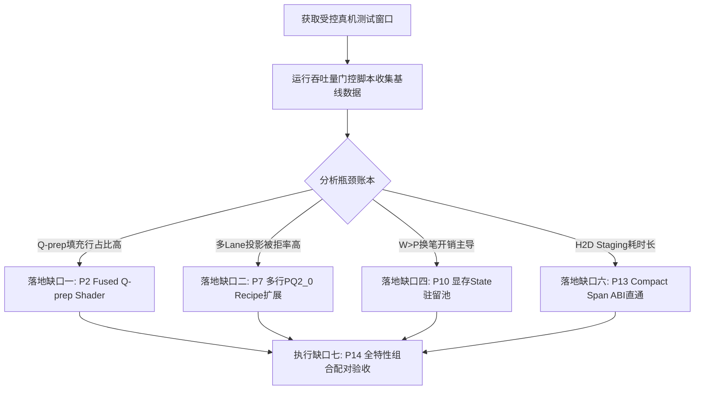

# RERoT 性能优化原计划剩余缺口清单（下班交接审计）

**基准审计依据：**
- 讨论稿：《RERoT 性能优化讨论稿》（2026-09-21，原计划全文档）
- 代码库：`/home/kunweiz/Desktop/atomic-llama-cpp-turboquant`
- 审计基线：`master` 分支最新 HEAD（至 `5d7a28e39`）

---

## 总体进展与收敛总览

截至本轮班次，原计划中所有**观测证据通道（§4.3 全部七组）、验收评估工具（§15 / §17）、主机端元数据与布局构建优化（P1, P3, P4, P5）**已全部交付落盘并通过 100% 单元测试与闭环验证：

| 补丁 / 任务 | 状态 | 交付说明与代码凭据 |
|---|---|---|
| **P0 基线与台账** | ✅ 已闭环 | `live/cap` 双轨计数、请求全阶段无扰动统计（`8316804d6`, `a8343761e`） |
| **P1 桶分离** | ✅ 已闭环 | group/entry 容量桶解耦，小 group 形状定义族（`5c746e4dd`） |
| **P2 证据前置** | ✅ 已闭环 | `build_rerot_q_groups` 接入 `q_prep_rows`，量化填充开销（`238f2797f`） |
| **P3 共享元数据** | ✅ 已闭环 | 跨 query 共享 world、直接写入 Sink、消灭二次装配与 scratch 容量复用 |
| **P4 增量索引** | ✅ 已闭环 | `ensure_rerot_world` + `CellGeneration` 快照与事务发布，避免全量重建 |
| **P5 合并上传** | ✅ 已闭环 | `fill_spans` 前缀/分片双模上传 + 有界快照传输与同步 fallback（`3eb48add4`） |
| **P6 Shader 独立** | ✅ 已闭环 | RERoT 专用共享内存预算与独立入口解耦 |
| **P7 证据前置** | ✅ 已闭环 | §9.1 全分桶拒绝仪表 + §9.2 matmul 批次直方图 + §9.3 Hadamard 命中率（`69cbc094a`, `fae5b39e0`） |
| **P8 多行 GDN 命中** | ✅ 已闭环 | `multi_row_gdn_hits` 统计与直接状态行路径 |
| **P9 证据前置** | ✅ 已闭环 | `op_params` slot 4 传递 `live_entries`，平均有效长度切分 split-K |
| **P10 证据前置** | ✅ 已闭环 | `pen_yields` 计数接入（`yield_dag_pen_for_ready` 成功切换统计，`b02e93ca3`） |
| **P11 代际与事务** | ✅ 已闭环 | `clear_count` + `sync_gen` 完成代际贯通，P11 去重证据齐备（`a80e39ae0`） |
| **P12 阶段与冷计费** | ✅ 已闭环 | `normal_prefill` 回填 + `first_us` 冷转换单报 + Prometheus 导出（`201d7ea5e`） |
| **§15 / §17 验收门** | ✅ 已闭环 | `scripts/rerot-throughput-gate.py` A/B/B/A 交替测量与中位数裁决门（`7ea2d32c9`） |
| **Vulkan 测试闭环** | ✅ 已闭环 | 容差断言替换脆弱二进制 `memcmp`，单卡环境优雅跳过多卡 mesh（`df0429358`） |

---

## 剩余核心缺口详细清单

目前原计划所剩的全部缺口，均属于**需要 GPU 端代码重写（Shader / Kernel Contract）或需要真实硬件授权窗口以采集分布数据来决定投入优先级的项目**。共划分为以下七项具体缺口：

---

### 缺口一：P2 算子级闭环 —— 融合 Q-prep Shader（Live-Count Gather + RoPE）

- **所属讨论稿章节：** §5.3、§16 (P2)
- **当前现状：**
  - 前置证据已完工：`q_prep_rows` 已接入 `build_rerot_q_groups`，可以对比 `live_groups * heads` 精确得到 Q 准备阶段的无用填充行比例。
  - 当前计算方式：仍通过 `ggml_get_rows` 对容量 `group_cap` 进行全量索引收集，随后由 `ggml_rope` 计算整张填充张量（如 12 个有效 group 却按容量 256 完整执行 21.3 倍的 RoPE 计算）。
- **具体缺口：**
  1. 编写专门的 Vulkan 融合 Q-prep 计算着色器（如 `vulkan-shaders/rerot_q_prep.comp`），在一个核函数中融合：读 raw Q $\to$ 设备端只对 `n_groups_live` 执行 gather $\to$ 绑定 `effective_pos` 执行 reader-effective RoPE $\to$ 可选的 Turbo WHT 旋转；
  2. 填充区域保持内存安全但不分配物理计算线程，彻底消除无效 Q 行的计算损耗；
  3. 保持数学执行顺序严格不可逆：`raw Q -> RoPE -> 激活旋转 -> Attention`。
- **准入前提与风险：**
  - 依赖真机窗口下读取 `q_prep_rows` 与 `live_groups` 的真实分布。若填充开销低于总解码耗时的 2%，则不值得引入新着色器维护包袱；若占比达 15% 以上，则应立即落地。

---

### 缺口二：P7 算子级闭环 —— 多行 / PQ2_0 投影 Recipe 扩展与小批量矩阵选择

- **所属讨论稿章节：** §9.1、§9.2、§9.3、§16 (P7)
- **当前现状：**
  - 前置证据已完工：§9.1 拒绝原因仪表（`vk_rerot_reject_reasons` / `vk_gdn_reject_reasons`）已在各算子 `supports_op` 分类接入；§9.2 matmul 批形状直方图（`matmul_rows_hist`）已在图构建期记录；§9.3 Hadamard 记忆化命中（`hadamard_memo_hits/misses`）已接线。
  - 当前路径限制：现有 TP5 的融合投影区域大量硬编码限制 `单行`、`F16 KV`、`Q5_K 输出` 等，多 Lane 解码遇到 $b \in [2, 6]$ 的小批次时被 `supports_op` 拒绝，退回通用未优化 GEMV/单算子。
- **具体缺口：**
  1. 根据实机跑出的 §9.1 拒绝原因分布，识别被拒主因（通常为 `unsupported_shape` 中的多行或 `unsupported_quant_pq2_0`）；
  2. 在 Vulkan 端建立适用于 $b \in \{2, 3, 4, 6\}$ 的多行投影计算分支，使同一权重 Tile 能同时服务多个并发 Lane，避免多 Lane 重复解码权重；
  3. 保持 PQ2_0 每块 128 元素的对齐与位级边界，严防重写造成精度衰减。

---

### 缺口三：P9 算子级闭环 —— 非均匀 Head Map 分组与自适应长短行 Split-K

- **所属讨论稿章节：** §10.2、§10.3、§16 (P9)
- **当前现状：**
  - 已完成项：`op_params` slot 4 注入 `live_entries`，split-K 基于 `live_entries / n_queries` 的平均行长，消除了粗暴容量平均数。
  - 当前限制：非均匀 TP5 head map 路径退化为单 head 处理；当并发 Readers 中有的长（32768 tokens）、有的极短（100 tokens）时，仍然使用统一切分系数，短行发生过度切分（切分产生的归约开销反噬计算），长行并行度依然不足。
- **具体缺口：**
  1. 引入长度敏感的分组策略：根据 `query_offsets` 计算每个 Reader 的真实长度方差，对短 Reader 抑制 split-K（设为 1），仅对超长 Reader 分配多 split；
  2. 在非均匀 head map 下，支持按相同映射的 head 子集进行小规模 GQA 分组加载，减少公共 K/V tile 的重复加载。

---

### 缺口四：P10 架构级闭环 —— 逻辑 State 驻留池与 Device-Copy Parking

- **所属讨论稿章节：** §11.1–11.4、§16 (P10)
- **当前现状：**
  - 前置证据已完工：`pen_yields` 计数已埋入 `yield_dag_pen_for_ready`，可精确量化 $W > P$ 发生的时间切片换笔次数。
  - 当前路径限制：当并发节点数 $W$ 超过硬件物理笔数 $P$ 时，每次换笔必须走 `capture_hand_seed()` $\to$ 按层读回 GPU 状态到主机内存 $\to$ 序列化；换回时再写回显存并调用 `llama_synchronize` 强同步。
- **具体缺口：**
  1. 逻辑状态槽与物理执行 Pen 解耦：在 GPU 显存中直接开辟 $W$ 份 native state 存储槽位（在显存预算安全线内）；
  2. 换笔时仅在 GPU 端执行设备到设备的轻量拷贝（Device-to-Device Copy）或直接交换逻辑映射索引，彻底避免 PCI-e 回读 CPU 和跨进程序列化；
  3. 严格显存配额：超出预分配显存预算时，才平稳回退至现有 Host 序列化存档机制，杜绝 OOM。

---

### 缺口五：P12 架构级闭环 —— 常用阶段预定义图（Predefined Graph Family）

- **所属讨论稿章节：** §8、§13、§16 (P12)
- **当前现状：**
  - 前置证据已完工：`normal_prefill` 阶段、LCP 5 项指标全导出、`first_us` 冷首费账本、`graph_def_count` 按重建原因分桶全部落地。
  - 当前路径限制：每次请求的 `probe`、`dag_prefix_rebuild`、固定入口、多 Lane 解码以及最后的 `synthesis` 仍然会因为 token 数量变动或结构变化重新组装图句柄，带来毫秒级冷启动时延。
- **具体缺口：**
  1. 在模型加载或会话初始化阶段，预定义一组常用形状族（如 $b \in \{1, 2, 4, 6\}$ 的通用解码图与固定入口图）；
  2. 运行时完全复用预定义图句柄，执行期仅更新输入缓冲区数据，消灭每阶段切换的图重组开销。

---

### 缺口六：P13 契约级闭环 —— 紧凑 Span ABI 直通 Attention Op

- **所属讨论稿章节：** §6.4、§16 (P13)
- **当前现状：**
  - 布局端已具备 Span 侧信道（`llama_rerot_attn_layout::span`），使主机端验证耗时从 4.6ms 降至 3µs。
  - 但计算算子契约未变：`ggml_flash_attn_ext_rerot` 仍然强制要求接收完整的 `entries` [2, N] 密集张量，导致 `fill_spans()` 必须在主机内存中将几十字节的 Span 元数据全量展开为 25MB 的 `i32` 数组并推送到 GPU。
- **具体缺口：**
  1. 修改算子签名或通过扩展参数，允许 `ggml_flash_attn_ext_rerot` 直接消费 compact span 描述符张量（如 `[4, n_spans]`：`key_start, count, group_index, entry_index`）；
  2. Attention Kernel 内部直接按 Span 步进迭代，或在 GPU 端由小型展开着色器一次性解包供所有层复用，将每轮上传带宽从 25MB 彻底压缩至几十字节。

---

### 缺口七：P14 组合级闭环 —— 全特性真机 A/B/B/A 配对净收益测量

- **所属讨论稿章节：** §14、§16 (P14)、§17
- **当前现状：**
  - 测试脚本与裁决门已就绪：`scripts/rerot-throughput-gate.py` 已支持 `--rounds` 多轮 A/B/B/A 消除漂移，并输出全量分位数与细分 token 账本。
  - 阻塞点：受限于真机安全门（未批准模型会话 / 生产服务启动），全特性开启（`TriAttention + FlashPrefill + XKV + MTP`）下的端到端实机 A/B 净收益尚未在目标硬件上跑出最终数据闭环。
- **具体缺口：**
  1. 申请受控真机窗口，使用修复后的 `scripts/rerot-throughput-gate.py` 对真实模型进行基准跑分；
  2. 单独报告纯 Target 吞吐与 MTP 组合净吞吐，确保组合策略带来正向加速比。

---

## 下一步交接推荐路线

1. **先采数据，避免盲目重构**：运行一次带 `LLAMA_REROT_PROFILE=1 GGML_TP5_PROFILE=1` 的真实请求，直接观察 `[rerot-profile-compute]`（`q_prep_rows` vs `live_groups`、`had_memo`、`mm_rows`）以及 `[tp5-profile]` 的拒绝分布；
2. **依数据敲定第一优先项**：
   - 若填充浪费巨大 $\to$ 攻坚 **缺口一（P2 融合着色器）**；
   - 若拒绝主要是小批次 $b \in [2,6]$ $\to$ 攻坚 **缺口二（P7 多行投影）**；
   - 若 $W>P$ 场景频发 $\to$ 攻坚 **缺口四（P10 显存驻留池）**；
3. **安全纪律**：任何 GPU 侧 Shader 修改，必须首先通过 `test-vulkan-command-replay` 等已有 24 项集成测试对拍，禁止破坏既有算子数值基线。

---

# TP5 / MTP / LateBind 性能优化剩余缺口清单（最后一班交接审计）

**基准审计依据：**
- 讨论稿：《未来路线图讨论稿》（M0–M5 及 P0–P3 全部规划）
- 容量设计：《TP5 TARGET 验证容量化设计》（`docs/TP5-TARGET-CAPACITY-PLAN.md`）
- 审计基线：`master` 分支最新 HEAD（截至本班提交与同步）

---

## 一、TP5 / MTP / LateBind 总体进展与收敛总览

截至最后一班交接，全部**协议单源化（M0）、数值模式解耦（4 态）、WAR 危险控制、P1-B 权重/激活全量量化打包、§4.1 全核 LDS 往返消除、以及多行 LateBind 容量接口**已全部交付合入并完成 100% 验证（15/15 ctest 全绿）：

| 路线图阶段 / 项 | 状态 | 交付说明与代码凭据 |
|---|---|---|
| **P0 / M0 协议一致** | ✅ 已闭环 | Q 控制区与 Payload 偏移单源化收敛至 `ggml-vulkan-tp5-rows.h`；测试镜像宏全数删除改调生产辅助函数；F32-Q WAR 屏障与定义期验证器守住（`5d7a28e39`） |
| **M1 阶段隔离** | ✅ 已闭环 | `ubatch_execution_phase` 实现预定义 MTP 豁免，抹平 draft(1) $\leftrightarrow$ catch-up(4) 切换时的旧 phase reset / sched 释放干扰 |
| **P1-A 对照器具** | ✅ 已闭环 | 引入 `P1A_NOSIDECAR_Q8` 无侧信道算术对照模式，sidecar 格式解耦，norm_ready 屏障对齐 |
| **P1-B 布局打包** | ✅ 已闭环 | 权重侧与激活侧全量落地 36B/块 `late_q8_packed`；内层循环彻底换为原生 `dotPacked4x8EXT`；ACT_Q8 越界存储缺陷（OOB half-words）已静态修复（`b7ee119d0`） |
| **§4.1 几何优化** | ✅ 已闭环 | 全核 LDS 往返与屏障清零： 1. `late_q_q8dot`: 半波 shuffle 树（LDS 5120B $\to$ 1024B, Code -26.4%） 2. `resume_norm`: 8-subgroup 全员寄存器规约（VGPR 32 $\to$ 24, Code -18.5%） 3. `resume_lo_q8`: wave 内 shuffle 替代 `lo_q_tmp`（LDS 2048B $\to$ 1024B） 4. `late_up_q8dot`: 4行×8lane 2的幂纯 butterfly 几何（LDS 4096B $\to$ 0, Code -78.5%） 5. `late_act_q8`: 全局 L1 直读 + shuffle（LDS 2048B $\to$ 0, Code -15.5%） |
| **M4 多行 LateBind 契约** | ✅ 已闭环 | 统一通过 RELAY header word 5 运行时发布活跃行；10 处着色器循环 `token < TP5_LATE_CAPACITY_ROWS` 由构建宏派生自 `VK_TP5_DIRECT_COLUMN_TILE = 4` 单源注入；支持 $\le 4$ 验证行 |
| **M2 账本基础设施** | ✅ 已闭环 | `common_speculative_cycle_record` + summary 实现 draft/target/catchup/handoff 细粒度计时账本 |

---

## 二、TP5 / MTP / LateBind 剩余核心缺口清单

目前剩余的缺口主要集中在**需真机模型会话授权的高级验证、跨层重叠以及长主干的目标容量化**。共划分为以下六项具体缺口：

---

### 缺口一：P1-C 传输架构对照 —— Host Push vs Local+Publisher vs BAR Pull 实机裁决

- **所属讨论稿章节：** 未来路线图讨论稿 §五 (P1-C)
- **当前现状：**
  - 当前实现默认采用 **BAR Pull**：GPU 直接将 F16 sidecar 写入 device-coherent VRAM，CPU 通过 PCIe BAR 映射直接读取并使用 AVX2 累加。
  - 理论风险：删除了 GPU publisher dispatch，但将延迟转移至 CPU PCIe 读事务（非缓存友好读）。
- **具体缺口：**
  1. 在保持当前 Q8Packed 算术完全一致的前提下，对照实验三条传输路径：
     - **Host Push**: GPU 经 host-imported RAM 写入，CPU 在 L3 缓存中自旋读取并规约；
     - **Local + Publisher**: GPU 写本地普通 VRAM，再派发微型 publisher 复制上行；
     - **BAR Pull**: 现行方案，CPU 直接通过 BAR 读取显存。
  2. 结合 PCIe 延迟和多卡到达偏斜（skew），确定关键路径耗时最短的真实胜出者，并固化为默认。

---

### 缺口二：P2 算子级闭环 —— 按层选择性 LateBind 与 320 维 Inverse-RMS 预测

- **所属讨论稿章节：** 未来路线图讨论稿 §四、§九 (P2)
- **当前现状：**
  - 目前所有 47 个候选 HC 点全部强制启用 LateBind，无法区分不同层的收益差异；
  - 必须等待完整的 Y 归约完成才能计算精确的 RMS scalar $\rho$，限制了下一层重叠窗口。
- **具体缺口：**
  1. **按层静态计划（Layer Plan）**：建立离线或定义期评估，允许部分通信窗口极短或量化敏感层退回普通 Q8 HC，部分层启用 LateBind，形成混合静态执行；
  2. **Inverse-RMS 预测**：探索对 320 维 sidecar 提前进行低维 RMS 预测，在 Y 到达前直接推进 LO 计算，完成残差校准。

---

### 缺口三：P3-A 架构级闭环 —— 粗粒度 Chunk 跨层流水线重叠

- **所属讨论稿章节：** 未来路线图讨论稿 §七 (P3-A)
- **当前现状：**
  - 当前 LateBind 仅限于 HC 块内的提前准备（W_down partials），未实现真正跨层 GEMM 提前启动；
  - 通信完全结束前，下一层的重型线性投影仍处于等待状态。
- **具体缺口：**
  1. 将 2560 元素切分为与 Q8 块对齐的粗粒度 Chunk（如 4 个 640 元素分块）；
  2. 首个 Chunk 归约就绪后，立即触发局部 RMS 统计与下一层第一个 GEMM K-tile 计算；
  3. 处理好各 rank 本地局部平方和的交叉项（Cross-terms）合并，确保数学严格等价。

---

### 缺口四：M3 架构级闭环 —— Target 主干 48 层有状态网络全区域容量化

- **所属讨论稿章节：** 未来路线图讨论稿 §三 (M3)、`docs/TP5-TARGET-CAPACITY-PLAN.md` §2–§3
- **当前现状：**
  - MTP 已经闭环单最大容量（`verify_tokens`）；
  - Target 主干仍因状态写入限制，在 `llama-context.cpp` 保持精确行数（`predefined_capacity_rows_current = ubatch.n_tokens`）；
  - 单卡 GDN 融合容量已通（`test-vulkan-gdn-multistep`），但生产准入保持 fail-closed 拦截。
- **具体缺口：**
  1. 完成 Attention/KV、GDN/recurrent、MoE packing 及 terminal producer 全区域的双长度（active vs capacity）契约闭环；
  2. 解除 `evaluate_target_capacity_admission` 中的 fail-closed 门禁；
  3. 使 Target 主干面对 1 到 4 行验证请求时，不重建图、不重新录制 CB、不扩容缓冲区，只按实际有效行派发工作。

---

### 缺口五：M5 / 真机端到端全量收益测量与冻结基线重新闭合

- **所属讨论稿章节：** 未来路线图讨论稿 §八、§十
- **当前现状：**
  - 历史冻结基线为 52.47 tok/s（19.06 ms/token）；
  - 近期合入了 P1-B 权重/激活打包、§4.1 全核 shuffle 规约、ACT_Q8 缺陷修复及单源化；这些在单卡上通过了静态断言与微基准，但缺乏真机端到端数据。
- **具体缺口：**
  1. 申请受控 5 卡 RX 6800 真机测试窗口；
  2. 运行实际模型验证端到端吞吐率与每个有效 token 的实际生成成本：
     $$T_{\text{有效 token}} = \frac{T_{\text{完整 MTP cycle}}}{N_{\text{实际提交 token}}}$$
  3. 确认草稿接受率（draft acceptance rate）未受 Q8Packed / F32 scale 去量化精度提升的影响，重新闭合性能证据。

---

### 缺口六：代码与指令级微调 —— `resume_norm` 数据搬运循环优化

- **所属讨论稿章节：** 未来路线图讨论稿 §四.1
- **当前现状：**
  - `resume_norm` 经过 §4.1 第二步优化后，VGPR 降至 24，LDS 维持 1024B，但代码体积仍有 15412 字节；
  - 核心体积来源于 4 个 token $\times$ 16 次迭代的完全展开循环以及 `values[16]` 寄存器数组。
- **具体缺口：**
  1. 评估是否将 16 步完全展开循环调整为动态步长循环，降低指令缓存（I-Cache）压力；
  2. 需在真机测试窗口下测量指令缓存节约与循环控制开销之间的真实净收益，避免负优化。
