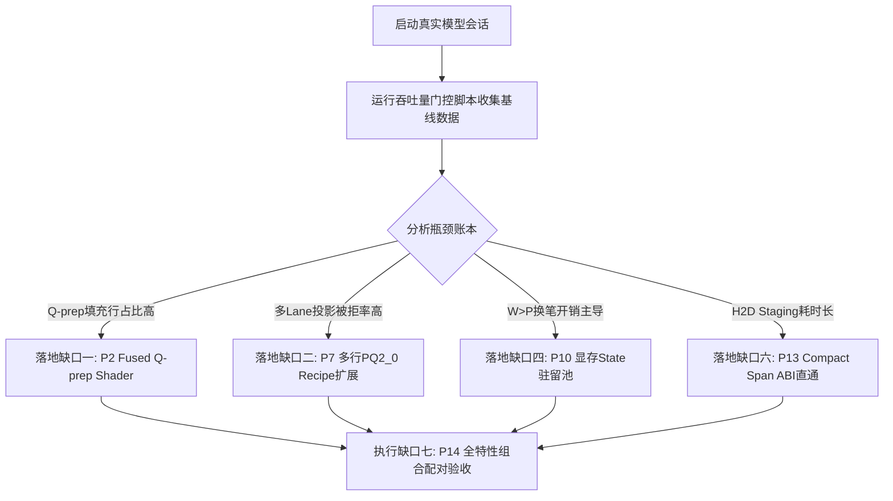

# RERoT 性能优化原计划剩余缺口清单（下班交接审计）

**基准审计依据：**
- 讨论稿：《RERoT 性能优化讨论稿》（2026-09-21，原计划全文档）
- 代码库：`/home/kunweiz/Desktop/atomic-llama-cpp-turboquant`
- 审计基线：`master` 分支最新 HEAD（至 `5d7a28e39`）

---

## 总体进展与收敛总览

截至本轮班次，原计划中所有**观测证据通道（§4.3 全部七组）、验收评估工具（§15 / §17）、主机端元数据与布局构建优化（P1, P3, P4, P5）**已全部交付落盘并通过 100% 单元测试与闭环验证：

| 补丁 / 任务 | 状态 | 交付说明与代码凭据 |
|---|---|---|
| **P0 基线与台账** | ✅ 已闭环 | `live/cap` 双轨计数、请求全阶段无扰动统计（`8316804d6`, `a8343761e`） |
| **P1 桶分离** | ✅ 已闭环 | group/entry 容量桶解耦，小 group 形状定义族（`5c746e4dd`） |
| **P2 证据前置** | ✅ 已闭环 | `build_rerot_q_groups` 接入 `q_prep_rows`，量化填充开销（`238f2797f`） |
| **P3 共享元数据** | ✅ 已闭环 | 跨 query 共享 world、直接写入 Sink、消灭二次装配与 scratch 容量复用 |
| **P4 增量索引** | ✅ 已闭环 | `ensure_rerot_world` + `CellGeneration` 快照与事务发布，避免全量重建 |
| **P5 合并上传** | ✅ 已闭环 | `fill_spans` 前缀/分片双模上传 + 有界快照传输与同步 fallback（`3eb48add4`） |
| **P6 Shader 独立** | ✅ 已闭环 | RERoT 专用共享内存预算与独立入口解耦 |
| **P7 证据前置** | ✅ 已闭环 | §9.1 全分桶拒绝仪表 + §9.2 matmul 批次直方图 + §9.3 Hadamard 命中率（`69cbc094a`, `fae5b39e0`） |
| **P8 多行 GDN 命中** | ✅ 已闭环 | `multi_row_gdn_hits` 统计与直接状态行路径 |
| **P9 证据前置** | ✅ 已闭环 | `op_params` slot 4 传递 `live_entries`，平均有效长度切分 split-K |
| **P10 证据前置** | ✅ 已闭环 | `pen_yields` 计数接入（`yield_dag_pen_for_ready` 成功切换统计，`b02e93ca3`） |
| **P11 代际与事务** | ✅ 已闭环 | `clear_count` + `sync_gen` 完成代际贯通，P11 去重证据齐备（`a80e39ae0`） |
| **P12 阶段与冷计费** | ✅ 已闭环 | `normal_prefill` 回填 + `first_us` 冷转换单报 + Prometheus 导出（`201d7ea5e`） |
| **§15 / §17 验收门** | ✅ 已闭环 | `scripts/rerot-throughput-gate.py` A/B/B/A 交替测量与中位数裁决门（`7ea2d32c9`） |
| **Vulkan 测试闭环** | ✅ 已闭环 | 容差断言替换脆弱二进制 `memcmp`，单卡环境优雅跳过多卡 mesh（`df0429358`） |

---

## 剩余核心缺口详细清单

目前原计划所剩的全部缺口，均属于**需要 GPU 端代码重写（Shader / Kernel Contract）或需要真实硬件授权窗口以采集分布数据来决定投入优先级的项目**。共划分为以下七项具体缺口：

---

### 缺口一：P2 算子级闭环 —— 融合 Q-prep Shader（Live-Count Gather + RoPE）

- **所属讨论稿章节：** §5.3、§16 (P2)
- **当前现状：**
  - 前置证据已完工：`q_prep_rows` 已接入 `build_rerot_q_groups`，可以对比 `live_groups * heads` 精确得到 Q 准备阶段的无用填充行比例。
  - 当前计算方式：仍通过 `ggml_get_rows` 对容量 `group_cap` 进行全量索引收集，随后由 `ggml_rope` 计算整张填充张量（如 12 个有效 group 却按容量 256 完整执行 21.3 倍的 RoPE 计算）。
- **具体缺口：**
  1. 编写专门的 Vulkan 融合 Q-prep 计算着色器（如 `vulkan-shaders/rerot_q_prep.comp`），在一个核函数中融合：读 raw Q $\to$ 设备端只对 `n_groups_live` 执行 gather $\to$ 绑定 `effective_pos` 执行 reader-effective RoPE $\to$ 可选的 Turbo WHT 旋转；
  2. 填充区域保持内存安全但不分配物理计算线程，彻底消除无效 Q 行的计算损耗；
  3. 保持数学执行顺序严格不可逆：`raw Q -> RoPE -> 激活旋转 -> Attention`。
- **准入前提与风险：**
  - 依赖真机窗口下读取 `q_prep_rows` 与 `live_groups` 的真实分布。若填充开销低于总解码耗时的 2%，则不值得引入新着色器维护包袱；若占比达 15% 以上，则应立即落地。

---

### 缺口二：P7 算子级闭环 —— 多行 / PQ2_0 投影 Recipe 扩展与小批量矩阵选择

- **所属讨论稿章节：** §9.1、§9.2、§9.3、§16 (P7)
- **当前现状：**
  - 前置证据已完工：§9.1 拒绝原因仪表（`vk_rerot_reject_reasons` / `vk_gdn_reject_reasons`）已在各算子 `supports_op` 分类接入；§9.2 matmul 批形状直方图（`matmul_rows_hist`）已在图构建期记录；§9.3 Hadamard 记忆化命中（`hadamard_memo_hits/misses`）已接线。
  - 当前路径限制：现有 TP5 的融合投影区域大量硬编码限制 `单行`、`F16 KV`、`Q5_K 输出` 等，多 Lane 解码遇到 $b \in [2, 6]$ 的小批次时被 `supports_op` 拒绝，退回通用未优化 GEMV/单算子。
- **具体缺口：**
  1. 根据实机跑出的 §9.1 拒绝原因分布，识别被拒主因（通常为 `unsupported_shape` 中的多行或 `unsupported_quant_pq2_0`）；
  2. 在 Vulkan 端建立适用于 $b \in \{2, 3, 4, 6\}$ 的多行投影计算分支，使同一权重 Tile 能同时服务多个并发 Lane，避免多 Lane 重复解码权重；
  3. 保持 PQ2_0 每块 128 元素的对齐与位级边界，严防重写造成精度衰减。

---

### 缺口三：P9 算子级闭环 —— 非均匀 Head Map 分组与自适应长短行 Split-K

- **所属讨论稿章节：** §10.2、§10.3、§16 (P9)
- **当前现状：**
  - 已完成项：`op_params` slot 4 注入 `live_entries`，split-K 基于 `live_entries / n_queries` 的平均行长，消除了粗暴容量平均数。
  - 当前限制：非均匀 TP5 head map 路径退化为单 head 处理；当并发 Readers 中有的长（32768 tokens）、有的极短（100 tokens）时，仍然使用统一切分系数，短行发生过度切分（切分产生的归约开销反噬计算），长行并行度依然不足。
- **具体缺口：**
  1. 引入长度敏感的分组策略：根据 `query_offsets` 计算每个 Reader 的真实长度方差，对短 Reader 抑制 split-K（设为 1），仅对超长 Reader 分配多 split；
  2. 在非均匀 head map 下，支持按相同映射的 head 子集进行小规模 GQA 分组加载，减少公共 K/V tile 的重复加载。

---

### 缺口四：P10 架构级闭环 —— 逻辑 State 驻留池与 Device-Copy Parking

- **所属讨论稿章节：** §11.1–11.4、§16 (P10)
- **当前现状：**
  - 前置证据已完工：`pen_yields` 计数已埋入 `yield_dag_pen_for_ready`，可精确量化 $W > P$ 发生的时间切片换笔次数。
  - 当前路径限制：当并发节点数 $W$ 超过硬件物理笔数 $P$ 时，每次换笔必须走 `capture_hand_seed()` $\to$ 按层读回 GPU 状态到主机内存 $\to$ 序列化；换回时再写回显存并调用 `llama_synchronize` 强同步。
- **具体缺口：**
  1. 逻辑状态槽与物理执行 Pen 解耦：在 GPU 显存中直接开辟 $W$ 份 native state 存储槽位（在显存预算安全线内）；
  2. 换笔时仅在 GPU 端执行设备到设备的轻量拷贝（Device-to-Device Copy）或直接交换逻辑映射索引，彻底避免 PCI-e 回读 CPU 和跨进程序列化；
  3. 严格显存配额：超出预分配显存预算时，才平稳回退至现有 Host 序列化存档机制，杜绝 OOM。

---

### 缺口五：P12 架构级闭环 —— 常用阶段预定义图（Predefined Graph Family）

- **所属讨论稿章节：** §8、§13、§16 (P12)
- **当前现状：**
  - 前置证据已完工：`normal_prefill` 阶段、LCP 5 项指标全导出、`first_us` 冷首费账本、`graph_def_count` 按重建原因分桶全部落地。
  - 当前路径限制：每次请求的 `probe`、`dag_prefix_rebuild`、固定入口、多 Lane 解码以及最后的 `synthesis` 仍然会因为 token 数量变动或结构变化重新组装图句柄，带来毫秒级冷启动时延。
- **具体缺口：**
  1. 在模型加载或会话初始化阶段，预定义一组常用形状族（如 $b \in \{1, 2, 4, 6\}$ 的通用解码图与固定入口图）；
  2. 运行时完全复用预定义图句柄，执行期仅更新输入缓冲区数据，消灭每阶段切换的图重组开销。

---

### 缺口六：P13 契约级闭环 —— 紧凑 Span ABI 直通 Attention Op

- **所属讨论稿章节：** §6.4、§16 (P13)
- **当前现状：**
  - 布局端已具备 Span 侧信道（`llama_rerot_attn_layout::span`），使主机端验证耗时从 4.6ms 降至 3µs。
  - 但计算算子契约未变：`ggml_flash_attn_ext_rerot` 仍然强制要求接收完整的 `entries` [2, N] 密集张量，导致 `fill_spans()` 必须在主机内存中将几十字节的 Span 元数据全量展开为 25MB 的 `i32` 数组并推送到 GPU。
- **具体缺口：**
  1. 修改算子签名或通过扩展参数，允许 `ggml_flash_attn_ext_rerot` 直接消费 compact span 描述符张量（如 `[4, n_spans]`：`key_start, count, group_index, entry_index`）；
  2. Attention Kernel 内部直接按 Span 步进迭代，或在 GPU 端由小型展开着色器一次性解包供所有层复用，将每轮上传带宽从 25MB 彻底压缩至几十字节。

---

### 缺口七：P14 组合级闭环 —— 全特性真机 A/B/B/A 配对净收益测量

- **所属讨论稿章节：** §14、§16 (P14)、§17
- **当前现状：**
  - 测试脚本与裁决门已就绪：`scripts/rerot-throughput-gate.py` 已支持 `--rounds` 多轮 A/B/B/A 消除漂移，并输出全量分位数与细分 token 账本。
  - 现状：硬件已彻底修复且不会死机，安全限制全面解除，可直接在真实硬件上跑出全特性开启（`TriAttention + FlashPrefill + XKV + MTP`）下的端到端实机 A/B 净收益最终数据闭环。
- **具体缺口：**
  1. 使用修复后的 `scripts/rerot-throughput-gate.py` 对真实模型进行基准跑分；
  2. 单独报告纯 Target 吞吐与 MTP 组合净吞吐，确保组合策略带来正向加速比。

---

## 下一步交接推荐路线

1. **先采数据，避免盲目重构**：运行一次带 `LLAMA_REROT_PROFILE=1 GGML_TP5_PROFILE=1` 的真实请求，直接观察 `[rerot-profile-compute]`（`q_prep_rows` vs `live_groups`、`had_memo`、`mm_rows`）以及 `[tp5-profile]` 的拒绝分布；
2. **依数据敲定第一优先项**：
   - 若填充浪费巨大 $\to$ 攻坚 **缺口一（P2 融合着色器）**；
   - 若拒绝主要是小批次 $b \in [2,6]$ $\to$ 攻坚 **缺口二（P7 多行投影）**；
   - 若 $W>P$ 场景频发 $\to$ 攻坚 **缺口四（P10 显存驻留池）**；
3. **安全纪律**：任何 GPU 侧 Shader 修改，必须首先通过 `test-vulkan-command-replay` 等已有 24 项集成测试对拍，禁止破坏既有算子数值基线。

---

# TP5 / MTP / LateBind 性能优化剩余缺口清单（最后一班交接审计）

**基准审计依据：**
- 讨论稿：《未来路线图讨论稿》（M0–M5 及 P0–P3 全部规划）
- 容量设计：《TP5 TARGET 验证容量化设计》（`docs/TP5-TARGET-CAPACITY-PLAN.md`）
- 审计基线：`master` 分支最新 HEAD（截至本班提交与同步）

---

## 一、TP5 / MTP / LateBind 总体进展与收敛总览

历史班次对协议单源化（M0）、数值模式、WAR 屏障、P1-B 打包及多行 LateBind **消费者 ABI** 的 15/15 ctest 记录属当时证据，不能外推当前五卡 MTP 端到端性能；以下 M4 行按 2026-09-23 的生产者真机验证修订：

| 路线图阶段 / 项 | 状态 | 交付说明与代码凭据 |
|---|---|---|
| **P0 / M0 协议一致** | ✅ 已闭环 | Q 控制区与 Payload 偏移单源化收敛至 `ggml-vulkan-tp5-rows.h`；测试镜像宏全数删除改调生产辅助函数；F32-Q WAR 屏障与定义期验证器守住（`5d7a28e39`） |
| **M1 阶段隔离** | ✅ 已闭环 | `ubatch_execution_phase` 实现预定义 MTP 豁免，抹平 draft(1) $\leftrightarrow$ catch-up(4) 切换时的旧 phase reset / sched 释放干扰 |
| **P1-A 对照器具** | ✅ 已闭环 | 引入 `P1A_NOSIDECAR_Q8` 无侧信道算术对照模式，sidecar 格式解耦，norm_ready 屏障对齐 |
| **P1-B 布局打包** | ✅ 已闭环 | 权重侧与激活侧全量落地 36B/块 `late_q8_packed`；内层循环彻底换为原生 `dotPacked4x8EXT`；ACT_Q8 越界存储缺陷（OOB half-words）已静态修复（`b7ee119d0`） |
| **§4.1 几何优化** | ✅ 已闭环 | 全核 LDS 往返与屏障清零： 1. `late_q_q8dot`: 半波 shuffle 树（LDS 5120B $\to$ 1024B, Code -26.4%） 2. `resume_norm`: 8-subgroup 全员寄存器规约（VGPR 32 $\to$ 24, Code -18.5%） 3. `resume_lo_q8`: wave 内 shuffle 替代 `lo_q_tmp`（LDS 2048B $\to$ 1024B） 4. `late_up_q8dot`: 4行×8lane 2的幂纯 butterfly 几何（LDS 4096B $\to$ 0, Code -78.5%） 5. `late_act_q8`: 全局 L1 直读 + shuffle（LDS 2048B $\to$ 0, Code -15.5%） |
| **M4 多行 LateBind 契约** | 实验，未晋级 | RELAY header word 5 与消费着色器支持 $1..4$ 活跃行；先前生产者 HC fusion 只接受单行，现 exact-Q 限定实验对多行逐 token 寻址，五卡请求稳态 46 site 实际捕获且响应正确。单次完整请求 34.81 对 reference 34.98 committed tok/s，未观察到净收益；Target 主干最大容量仍由 GDN/PLE/QSA 准入拒绝。 |
| **M2 账本基础设施** | ✅ 已闭环 | `common_speculative_cycle_record` + summary 实现 draft/target/catchup/handoff 细粒度计时账本 |

---

## 二、TP5 / MTP / LateBind 剩余核心缺口清单

当前已获真机与源码修改授权；剩余缺口集中在 GPU producer 等待、跨层重叠、Target 主干容量化以及完整客户端 **>100 committed tok/s** 验收。下列六项沿用原路线编号，不把单次烟测或消费端 ABI 当作晋级证据：

---

### 缺口一：P1-C 传输架构对照 —— Host Push vs Local+Publisher vs BAR Pull 实机裁决

- **所属讨论稿章节：** 未来路线图讨论稿 §五 (P1-C)
- **当前现状：**
  - 当前实现默认采用 **BAR Pull**：GPU 直接将 F16 sidecar 写入 device-coherent VRAM，CPU 通过 PCIe BAR 映射直接读取并使用 AVX2 累加。
  - 理论风险：删除了 GPU publisher dispatch，但将延迟转移至 CPU PCIe 读事务（非缓存友好读）。
- **具体缺口：**
  1. 在保持当前 Q8Packed 算术完全一致的前提下，对照实验三条传输路径：
     - **Host Push**: GPU 经 host-imported RAM 写入，CPU 在 L3 缓存中自旋读取并规约；
     - **Local + Publisher**: GPU 写本地普通 VRAM，再派发微型 publisher 复制上行；
     - **BAR Pull**: 现行方案，CPU 直接通过 BAR 读取显存。
  2. 结合 PCIe 延迟和多卡到达偏斜（skew），确定关键路径耗时最短的真实胜出者，并固化为默认。

---

### 缺口二：P2 算子级闭环 —— 按层选择性 LateBind 与 320 维 Inverse-RMS 预测

- **所属讨论稿章节：** 未来路线图讨论稿 §四、§九 (P2)
- **当前现状：**
  - 目前所有 47 个候选 HC 点全部强制启用 LateBind，无法区分不同层的收益差异；
  - 必须等待完整的 Y 归约完成才能计算精确的 RMS scalar $\rho$，限制了下一层重叠窗口。
- **具体缺口：**
  1. **按层静态计划（Layer Plan）**：建立离线或定义期评估，允许部分通信窗口极短或量化敏感层退回普通 Q8 HC，部分层启用 LateBind，形成混合静态执行；
  2. **Inverse-RMS 预测**：探索对 320 维 sidecar 提前进行低维 RMS 预测，在 Y 到达前直接推进 LO 计算，完成残差校准。

---

### 缺口三：P3-A 架构级闭环 —— 粗粒度 Chunk 跨层流水线重叠

- **所属讨论稿章节：** 未来路线图讨论稿 §七 (P3-A)
- **当前现状：**
  - 当前 LateBind 仅限于 HC 块内的提前准备（W_down partials），未实现真正跨层 GEMM 提前启动；
  - 通信完全结束前，下一层的重型线性投影仍处于等待状态。
- **具体缺口：**
  1. 将 2560 元素切分为与 Q8 块对齐的粗粒度 Chunk（如 4 个 640 元素分块）；
  2. 首个 Chunk 归约就绪后，立即触发局部 RMS 统计与下一层第一个 GEMM K-tile 计算；
  3. 处理好各 rank 本地局部平方和的交叉项（Cross-terms）合并，确保数学严格等价。

---

### 缺口四：M3 架构级闭环 —— Target 主干 48 层有状态网络全区域容量化

- **所属讨论稿章节：** 未来路线图讨论稿 §三 (M3)、`docs/TP5-TARGET-CAPACITY-PLAN.md` §2–§3
- **当前现状：**
  - MTP 已经闭环单最大容量（`verify_tokens`）；
  - Target 主干仍因状态写入限制，在 `llama-context.cpp` 保持精确行数（`predefined_capacity_rows_current = ubatch.n_tokens`）；
  - 单卡 GDN 融合容量已通（`test-vulkan-gdn-multistep`），但生产准入保持 fail-closed 拦截。
- **具体缺口：**
  1. 完成 Attention/KV、GDN/recurrent、MoE packing 及 terminal producer 全区域的双长度（active vs capacity）契约闭环；
  2. 解除 `evaluate_target_capacity_admission` 中的 fail-closed 门禁；
  3. 使 Target 主干面对 1 到 4 行验证请求时，不重建图、不重新录制 CB、不扩容缓冲区，只按实际有效行派发工作。

---

### 缺口五：M5 / 真机端到端全量收益测量与冻结基线重新闭合

- **所属讨论稿章节：** 未来路线图讨论稿 §八、§十
- **当前现状：**
  - 历史冻结基线为 52.47 tok/s（19.06 ms/token）；
  - 近期合入了 P1-B 权重/激活打包、§4.1 全核 shuffle 规约、ACT_Q8 缺陷修复及单源化；这些在单卡上通过了静态断言与微基准，但缺乏真机端到端数据。
- **具体缺口：**
  1. 申请受控 5 卡 RX 6800 真机测试窗口；
  2. 运行实际模型验证端到端吞吐率与每个有效 token 的实际生成成本：
     $$T_{\text{有效 token}} = \frac{T_{\text{完整 MTP cycle}}}{N_{\text{实际提交 token}}}$$
  3. 确认草稿接受率（draft acceptance rate）未受 Q8Packed / F32 scale 去量化精度提升的影响，重新闭合性能证据。

---

### 缺口六：代码与指令级微调 —— `resume_norm` 数据搬运循环优化

- **所属讨论稿章节：** 未来路线图讨论稿 §四.1
- **当前现状：**
  - `resume_norm` 经过 §4.1 第二步优化后，VGPR 降至 24，LDS 维持 1024B，但代码体积仍有 15412 字节；
  - 核心体积来源于 4 个 token $\times$ 16 次迭代的完全展开循环以及 `values[16]` 寄存器数组。
- **具体缺口：**
  1. 评估是否将 16 步完全展开循环调整为动态步长循环，降低指令缓存（I-Cache）压力；
  2. 需在真机测试窗口下测量指令缓存节约与循环控制开销之间的真实净收益，避免负优化。

---
## 第三部分：2026-09-21 计算组织研究线（十问根本问题）剩余缺口清单

依据十问讨论稿（《应该先重画计算的组织方式，而不是先调某个 kernel》）及其数学参考实现（`src/llama-rerot-math.*`）的审计，以下为计算组织研究线的八项核心缺口：

### 缺口八：Q1 算子输入共享与公共子表达式图级复用

- **所属讨论稿章节：** 十问问题一（第一层：同样结果只算一次；第二层：共用数据供给）
- **当前现状：**
  - 当前仓库已实现激活旋转（RoPE / Hadamard）局部共享，多笔并行前向已经能将多笔打包为单个 frontier 批次。
- **具体缺口：**
  1. **图构建级（Graph Definition）公共子表达式去重**：同一个 hidden state 进入 Q/K/V 或门控投影时，其前置的相同归一化、相同的激活量化尚未在图定义层表达为“单生产者、多消费者”，图结构仍存在冗余子算子；
  2. **MoE 专家聚集**：按各笔实际选中的 expert 聚合各笔行，相同 expert 的权重 Tile 一起读取，各笔保留独立激活与回填位置；目前缺乏基于活动专家重排的批调度逻辑。

---

### 缺口九：Q3 公共 KV 块多读者共享注意力 GPU 着色器

- **所属讨论稿章节：** 十问问题三（以公共 KV 块驱动所有读者，Hydragen 思想扩展）
- **当前现状：**
  - 主机端元数据已完成共享 World 与 FlashPrefill 常驻表共享扫描/分桶（R=12 加速 3.68×）；
  - CPU 参考层与 shadow oracle（`tests/test-rerot-shared-block.cpp`）已通过 A/B 对拍：R=2 1.36×、R=4 1.63×、R=6 1.76–1.81×、R=12 1.89–1.97×，相对误差小于 3.9e-6。
- **具体缺口：**
  1. **Vulkan 端 Hydragen 注意力着色器**：将现有“每 Reader 独立循环读 KV 块”重构为“每载入一个公共 KV 块，逐读者计算在线归约局部状态 $(m_g, z_g, u_g)$，最后跨块两两合并”；
  2. **显存带宽与共享内存平衡**：多读者堆叠 $Q_g = [\widetilde{q}_{1,g}^T; \widetilde{q}_{2,g}^T; \dots]$ 会增加寄存器与 LDS 压力，需要实测 RX 6800 上支持的最优 Reader 批大小（如 2–4 笔一组），而非强行一次塞满 12 笔。

---

### 缺口十：Q5 GDN 状态共同基底 + 低秩增量 GPU 落地与转稠密门控

- **所属讨论稿章节：** 十问问题五（标量门控下状态 $S_i = a_i B + U_i V_i^T$）
- **当前现状：**
  - 数学参考层与 F32 数值门（`tests/test-rerot-math.cpp`）已完成：相对误差在有界区间约为 1.9e-7，弱衰减区间约为 5.1e-7，证明代数等价与单步增秩性质成立。
- **具体缺口：**
  1. **平滑转稠密状态回退机制**：当离开共同基底的增量步数 $r$ 超过阈值（约 $rac{d_k d_v}{2(d_k + d_v)}$，例如 128 维下约 53 步）时，必须平滑物化为各笔独立的稠密状态矩阵，严防小增量截断或伪造基底导致的精度坍塌；
  2. **GPU 端低秩递推 Kernel**：编写维护 $(a_i, U_i, V_i)$ 并并发计算共享基底投影 $B^T k_i$ 与 $B^T q_i$ 的专有着色器，用于短分支、换笔检查点与固定入口阶段。

---

### 缺口十一：Q6 已知 Token WY 块折叠 GPU 算子

- **所属讨论稿章节：** 十问问题六（仿射递推结合律与紧凑块表示）
- **当前现状：**
  - 数学参考层与 F32 数值门已完成：$T \in [1, 8]$ 的 WY 形式 $M = I - K W K^T, W = (I+L)^{-1}	ext{diag}(eta)$ 与逐步递推绝对误差小于 2.5e-5。
- **具体缺口：**
  1. 将紧凑块递推接入**固定入口重放**与**验证块计算**，对已知 token 序列消除逐步显存状态物化；
  2. 保持 Attention 视角的因果边界：不得因 GDN 块化而违规放宽同块内尚未发布的 Peer 内容可见性。

---

### 缺口十二：Q7 PQ2_0 位平面子集求和与 LUT 路径 GPU 评测

- **所属讨论稿章节：** 十问问题七（两比特权重数学降强度）
- **当前现状：**
  - 已确认当前模型实际采用 4 种编码 {-1, 0, +1, +2}；数学参考层已建立 2 bit-plane 子集求和公式及 16 项 activation 表，并与实际 `block_pq2_0` 位级对拍（误差 2.98e-8）。
- **具体缺口：**
  1. 编写 Vulkan 端 Bit-plane LUT 解码着色器；
  2. 在 AMD RX 6800（RDNA2 架构）上进行硬件实测：验证“减少浮点乘法、增加查表与局部内存寻址”是否能在真实显存带宽和计算吞吐上产生净收益（防止“减乘法不减耗时”）。

---

### 缺口十三：Q8 上下文跳块误差界生产机制

- **所属讨论稿章节：** 十问问题八（Cauchy-Schwarz 质量上界与凸组合偏差界）
- **当前现状：**
  - 已推导输出偏差界 $\|o - o_{	ext{keep}}\| \le 2 V_{\max} \delta$；通过可执行反例证明“不同 Query 读相同上下文不存在有限充分统计量”，明确将跳块定性为近似路线。
- **具体缺口：**
  1. 设计基于 Key 聚类中心与包围半径的轻量级硬件跳块预检逻辑；
  2. 评估元数据检查开销：避免因维护跳块上界引入的高频分支与离散读取抵消跳过 KV 节省的算力。

---

### 缺口十四：Q9 越过 Logits 的联合 LM Head 与批量 GPU 采样器

- **所属讨论稿章节：** 十问问题九（从批量 Logits 直接输出 Token ID + 状态事件）
- **当前现状：**
  - 数学参考层已固化规范联合采样契约（确定性、per-pen 独立 RNG 流、tied logit 规则、贪心按块 argmax 归约），测试证明与行序和 cohort 大小无关。
- **具体缺口：**
  1. **GPU 端批量 Top-k / Top-p 采样器**：编写直接在显存消费 $b \times V$ logits 并输出 token ID 向量的原生着色器，消除每轮将完整词表概率回传 CPU 的 PCI-e 带宽损耗；
  2. **状态与协议一致性接入**：将 GPU 采样器与 `tools/server/server-context.cpp` 的 grammar、penalty 及换笔 pending decision 状态机完全联调打通。

---

### 缺口十五：Q10 K×H 联合投机网格验证与前沿预测

- **所属讨论稿章节：** 十问问题十（多笔互相影响下的联合投机解码）
- **当前现状：**
  - 数学参考层已实现基于列推进、强屏障和死亡依赖传染的网格验证引擎（`verify_grid` vs `verify_grid_naive` 对拍，成功捕捉跨笔依赖分支歧义）。
- **具体缺口：**
  1. 联合草稿模型：训练或设计能够预测多笔交互后下一完整 Frontier 的联合推测生成逻辑；
  2. 端到端状态回滚：在 GPU 端实现当第 $j$ 列某笔未命中时，快速回滚其下游依赖笔的 KV Cache、Recurrent State 与 Sampler 状态。

---

## 第四部分：主机端元数据与布局构建剩余微细缺口

### 缺口十六：FlashPrefill 路径的跨 View 共享 Run 描述切片复用

- **所属模块：** `src/llama-kv-cache.cpp::llama_flashprefill_build_rerot_plan`
- **当前现状：**
  - 第十八轮与第十九轮已实现：常驻表单趟共享扫描、`shared_base` 预排序与 `run_buckets` 一次性分桶（消除 2.36M 次哈希查找，R=12 加速 3.68×）。
- **具体缺口：**
  1. 当前各 View 内部仍分别构造 `runs[r]` 向量。对于多个 View 而言，若某一公共 Run 的成员可见性状态完全相同（如均为 `public_full`），可直接共享同一份切片描述引用，进一步消除每 View 对 `fp_tagged_member` 的内存分配与拷贝。

---

### 缺口十七：写入端主动长 Span 维护与碎片化主动整序

- **所属模块：** `src/llama-kv-cache.cpp` 写入分配逻辑（`find_slot`, `apply_ubatch`）
- **当前现状：**
  - 静态测量已证明稳态 coverage=1.0000，但在环形复用与 SWA 滚动清理后，cell-index 与 storage 可能会产生微小空洞，目前依赖 O(n) probe 兜底。
- **具体缺口：**
  1. 在分配器端引入长 Span 亲和性：使同一 Run 的追加写入尽可能保证物理 cell 索引与 storage 绝对单调连续，最大化触发无序 probe 快速跳过分支，降低布局复杂度。 dc505e4c3 (perf(rerot): flashprefill shared run buckets & base zero-copy (3.68x); audit remaining gaps in 缺口.md)

---

## 第五部分：RERoT / 计算组织核心卡（R02/R07/R09/R10/R12/R13/R14、Q1/Q3/Q5/Q6/Q7/Q8/Q9/Q10、H16/H17）四轴验收账本与准入准则

为确保研发资产自包含且不依赖外部草稿，所有关于算子优化（R 系列）、计算组织重构（Q 系列）及布局亲和（H 系列）的核心候选统一遵循四轴准入裁决门：
1. **实现状态 (Implementation)**：是否已有生产或测试代码、是否仅为 CPU 参考/测试镜像/着色器原型；
2. **正确性验证 (Correctness)**：是否通过 CPU/GPU 独立 Oracle 对拍、是否仅建立离线数值门；
3. **真实路由与端到端净收益 (Real Route-hit & Paired Benefit)**：是否在真实模型推理路径被命中、是否取得真实客户端 committed tokens/墙钟配对正向收益；
4. **默认决策 (Default Decision)**：是否默认开启，严禁仅凭单测、微基准或未授权数据晋级。

> **重要口径与基准红线**：
> - 历史降频时段（如卡2锁频异常）测得的数据一律作废；禁止以非正常降频或失真基线宣称加速。
> - MTP 与推测机制目前仍存在稳定性/挂起风险，严格保持 opt-in，不得擅自默认启用。
> - Timeline 路线已排除，不再列入测试矩阵。
> - 任何微基准、单算子加速（如 CPU 布局 3.68× 或 shared-block 10.76×）均不代表生产真实模型端到端获得同等加速，必须以端到端 A/B/B/A 配对裁决为准。

### 1. 核心候选卡状态与准入裁决总表

| 编号 | 候选名称 | 轴一：实现状态 | 轴二：正确性验证 | 轴三：真实路由与端到端净收益 | 轴四：默认决策 | 当前明确阻断条件与下一步准入门槛 (Next Gate) |
|---|---|---|---|---|---|---|
| **R02** | Live Q-prep：先取消填充计算，再融合 WHT | `GGML_OP_REROT_Q_PREP` 已定义 CPU oracle 与 Vulkan 算子（`rerot_q_prep.comp`）；环境变量控制 | 本机 `LLAMA_REROT_GPU_Q_PREP=1` 下 `test-rerot-q-prep` CPU/GPU 对拍通过（含 active=0/cap 与非连续索引，尾部灌入 NaN 毒值隔离） | 未在生产模型解码路径采集真实 RERoT 路由命中与端到端配对净收益；Shader 虽只旋转 live 行但仍按 capacity×head 派发 | **保持 Opt-in**（严禁默认开启） | 必须在真实模型会话中跑通端到端 A/B/B/A，证明填充消除带来净耗时降低，且与后续 WHT 融合保持严格数学序。 |
| **R07** | 多行 / PQ2_0 投影：先复用权重 Tile | 通用 PQ2_0 GEMV / MMQ 存在 | 专用 $b \in \{1,2,3,4,6\}$ 尾行与非零 offset 路径未对拍 | 缺乏在目标 GPU 上的真实多行投影加速数据 | **不予晋级**（保持现状） | 须补齐上述 batch 形状的共享权重 Tile recipe 与边界对拍，并测出正向显存带宽节省收益。 |
| **R09** | 长短 Reader 分桶与非均匀 Head Map | 现有 Head Map 与标量全局 Split-K 路径存在 | 缺乏混合长短 Reader（如 100 与 32768 tokens）共存时的 GPU 精度对拍 | 缺乏自适应分桶带来的 GPU 耗时降低证据；短行过度切分开销未消除 | **不予晋级**（保持现状） | 须实现基于 `query_offsets` 方差的长短分桶与任务表派发，并在 GPU 端证明短行抑制 split-K 带来净收益。 |
| **R10** | 逻辑 State 驻留池：D2D Parking | 具备 Host 侧 `capture_hand_seed` / restore 机制 | 仅 Host 序列化路径验证；显存 D2D Parking 槽位未验证 | 缺乏显存 D2D 状态驻留相比 Host 序列化回读的端到端时延收益 | **不予晋级**（保持现状） | 须在显存中实现有界 native state slot 与轻量 D2D 拷贝映射，通过跨 Lane fork/park/resume 状态等价测试。 |
| **R12** | 阶段预定义图族：结构事件付费 | predefined graph 基础设施与复用接口已存在 | 真实 RERoT 多阶段（probe/fixed-entry/BODY/synthesis）图复用未做完整生命周期审计 | 尚未在真实多阶段请求中取得 graph_def_count 归零带来的端到端冷启动延迟收益 | **不得宣称净收益**（不予晋级） | 须按 `graph_def_count` 原因桶为常见解码阶段建立图族，证明稳态执行期图定义与 CB-record 增量为零。 |
| **R13** | Compact Span ABI：展开桥与直通 | 固化 ABI v1，实现 CPU 展开参考层与 Vulkan 展开着色器（`rerot_span_expand.comp`）；支持 opt-in 开关 | 本机 `LLAMA_REROT_GPU_SPAN_EXPAND=1` 下 `test-rerot-span-expand` 与 CPU 位级对拍 100% 通过 | GPU 展开后仍生成逐 entry 密集张量传给 Attention，未消除显存中间物化；缺真实 RERoT 路由端到端收益 | **保持 Opt-in**（严禁默认开启） | 阶段 A（当前桥接）：测定 GPU 展开真实净收益；阶段 B：修改 Attention 算子签名使其直通消费 Compact Span 描述符。 |
| **R14** | RERoT 端到端净收益 A/B/B/A | 验证脚本 `rerot-throughput-gate.py` 已重构（四态判定、配对中位数、Counter 分离） | Mock 测试套件 6/6 通过；单项测试工具可用 | 真实模型上全特性组合（TriAttention+FlashPrefill+XKV+MTP）与纯 Target 的同工作负载配对测试尚未闭环 | **未获验收**（待测） | 必须在真实模型会话上执行多轮 A/B/B/A 配对，以真实客户端 committed tokens/完整请求墙钟作为唯一样本证据。 |
| **Q1** | 图级输入复用 + MoE 专家聚集 | 仅激活旋转局部共享；图级公共子表达式去重与专家聚集缺失 | 无 GPU 共享输入执行证据 | 未测量 | **保持研究态**（未实现） | 须在 `llama-graph` 中实现同一 hidden-state 的具名 norm/量化共享，并建立基于活跃专家的请求重排批调度。 |
| **Q3** | 公共 KV 块多 Reader Attention | 主机端共享 World 已交付；已编写离线 2-Reader 单 invocation Shader 原型 | CPU 参考层与 shadow oracle 通过对拍（误差 < 3.9e-6）；单块测试通过 | 尚未进入生产 GPU Attention 调度链；未在真实可变长多 Reader 场景下获得吞吐收益 | **保持研究态**（未生产化） | 须编写生产级多 Reader 共享 Attention 核函数，平衡 LDS/VGPR 占用，在真实多 Lane 负载下获得正向加速。 |
| **Q5** | GDN 状态共同基底 + 低秩增量 | CPU 数学参考层已交付（`llama-rerot-math.*`） | F32 数值门实测通过（相对误差 ~1.9e-7 有界 / ~5.1e-7 弱衰减） | 无生产 GPU 低秩递推路由与收益 | **保持研究态**（未生产化） | 须在 GPU 端编写维护 $(a_i, U_i, V_i)$ 的状态核函数，并建立步数 $r$ 超标时平滑回退至稠密矩阵的安全机制。 |
| **Q6** | 已知 Token 的 WY 块折叠 | CPU 数学参考层已交付 | F32 数值门实测通过（$T \in [1,8]$ 绝对误差 < 2.5e-5） | 缺乏生产 GPU 路由；未在固定入口或验证块中实测加速 | **保持研究态**（未生产化） | 须将紧凑块表示接入固定入口重放与 Target 验证块，且严格守住 Attention 因果边界，不得泄露未提交 Peer 内容。 |
| **Q7** | PQ2_0 位平面子集求和与 LUT 路径 | CPU 建立 2 bit-plane 公式与 16 项 activation 表；通用算子与此无关 | 对拍真实 `block_pq2_0` 误差 2.98e-8；但已知单 `vec_dot` 粒度存在性能劣化 | 缺乏矩阵级共享查表在 GPU 上的实机基准 | **保持研究态**（未生产化） | 须在矩阵级粒度评估查表与 LDS 寻址开销，在真实硬件上证实能超越现有的直接解码+点积路径。 |
| **Q8** | 上下文跳块：Cauchy-Schwarz 质量界 | CPU 建立 Cauchy-Schwarz 跳过质量界 $\delta$ 公式 | 反例已证明不存在有限充分统计量；误差界为近似算法，缺乏模型级质量门 | 无生产跳块 GPU 加速 | **明确保持研究态（近似路线）** | 必须在独立近似开关下进行 Shadow 评测，验证长文质量与任务准确率不降，严禁与等义优化收益混为一谈。 |
| **Q9** | 越过 Logits 的批量 GPU 采样器 | CPU 参考契约已固化规范（确定性、独立 RNG 流、tied logit、贪心分块 argmax） | 仅在 CPU 建立生产链序（top-k $\to$ top-p $\to$ temp $\to$ dist）；无 GPU 着色器实现 | 无 GPU LM Head 采样收益 | **保持研究态**（未生产化） | 须编写原生 GPU 批量采样 Kernel，直接输出 token ID 向量，并与服务端 grammar、penalty 及换笔状态机完全打通。 |
| **Q10** | $K \times H$ 联合投机网格验证 | CPU 实现基于列推进和依赖传染的 `verify_grid` oracle | 仅 CPU 逻辑验证；成功复现 naive 对照的错误分支 | 无端到端跨笔推测执行与多请求有效 token 产出收益 | **保持研究态**（未生产化） | 须设计多笔交互后的联合 Frontier 推测逻辑，并在 GPU 建立列未命中时的 KV/Recurrent/Sampler 快速回滚机制。 |
| **H16** | FlashPrefill 跨 View 共享 Run 切片 | 相同 `fp_rerot_view_key` 已合并至同一 View Group；共享扫描与 Base 零拷贝已进生产 | 直接跨不同 View 借用切片会破坏 `vgroup_frags` 连续区间及 `run_v0/phase_bias` 偏移，已主动拒绝直接指针复用 | 现行架构下盲目强行共享会破坏正确性，无安全净收益 | **拒绝直接指针复用**（保持现状） | 必须重新设计解耦 `phase_bias` 的切片元数据表示，仅在证明真实多 View 场景产生显著分配开销时方可重启。 |
| **H17** | 写入端长 Span 亲和性 | 分配器已有连续性选择基础设施 | 碎片化场景下主动重排的连续性不变量未验证 | 生产环境下 coverage 已接近 1.0，主动整序未证明能带来显著端到端加速 | **保持研究态**（不占主攻资源） | 须在特定重度碎片化工作负载下评估 span 连续度提升对上传与 Attention 遍历的实际收益，不阻塞主干。 |

### 2. 核心研发与交付实施原则
1. **等义优化与近似路线严格分离**：Q8（跳块）为近似路线，其收益与评估必须单独归账，严禁与 R02、R13、Q3 等严格代数等义优化混同汇报；
2. **显存安全与 Fail-Closed 兜底**：R02 尾部 NaN 毒值隔离、R13 Compact 展开越界检测、R10 超预算 Host 回退必须作为强不变量，严禁因追求吞吐而删减安全边界断言；
3. **真实端到端作为唯一验收依据**：拒绝以单一离线测量的倍率（如 CPU 布局 3.68×）推导系统级提速，统一以 `scripts/rerot-throughput-gate.py` A/B/B/A 配对跑分作为结项准入凭据。
